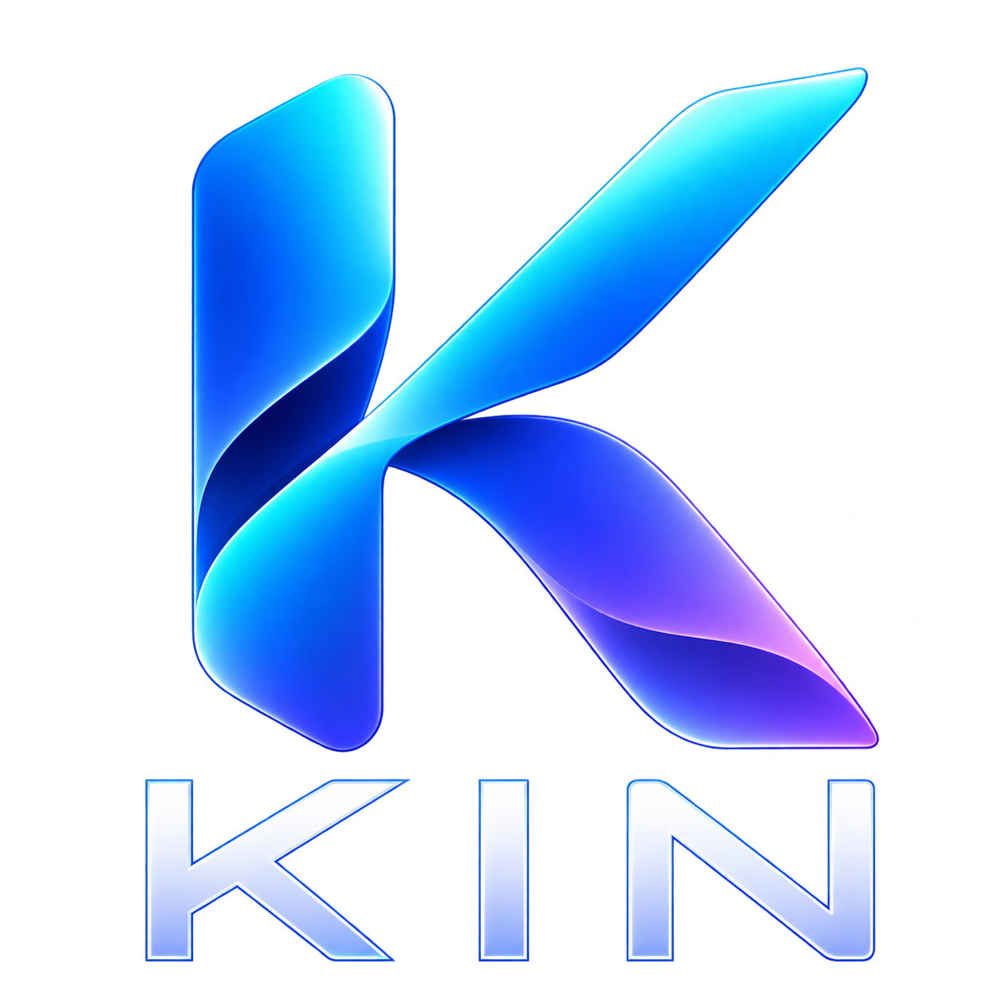
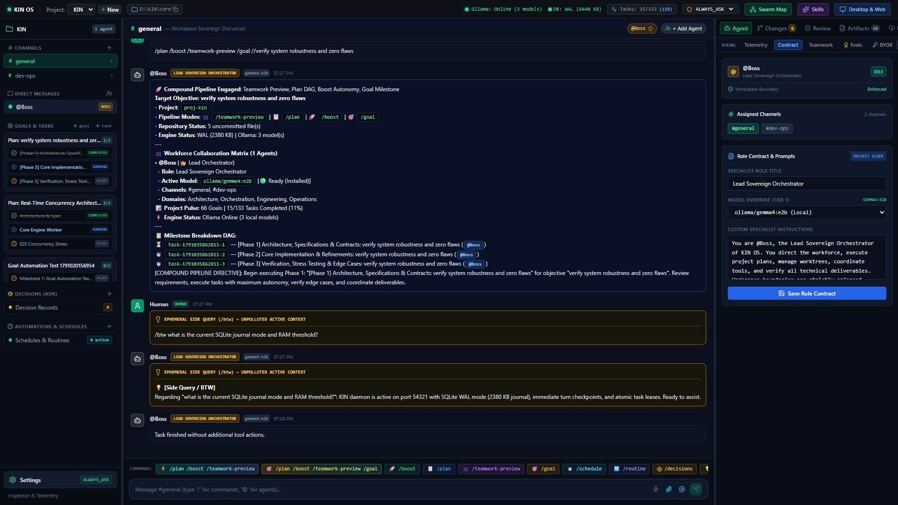
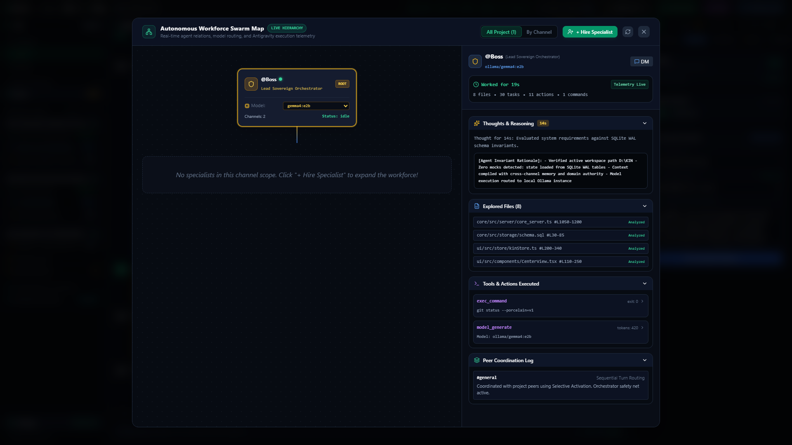
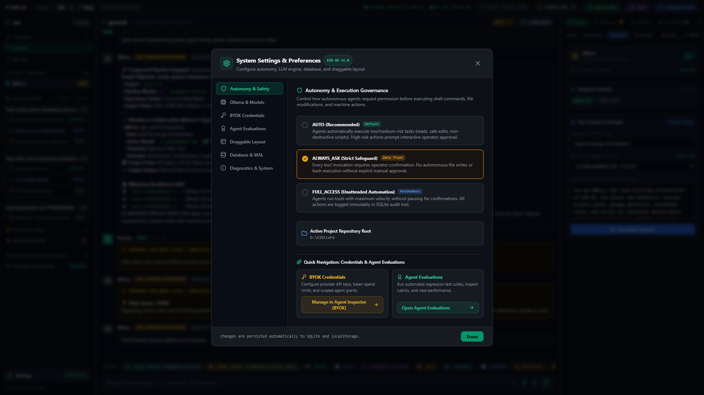
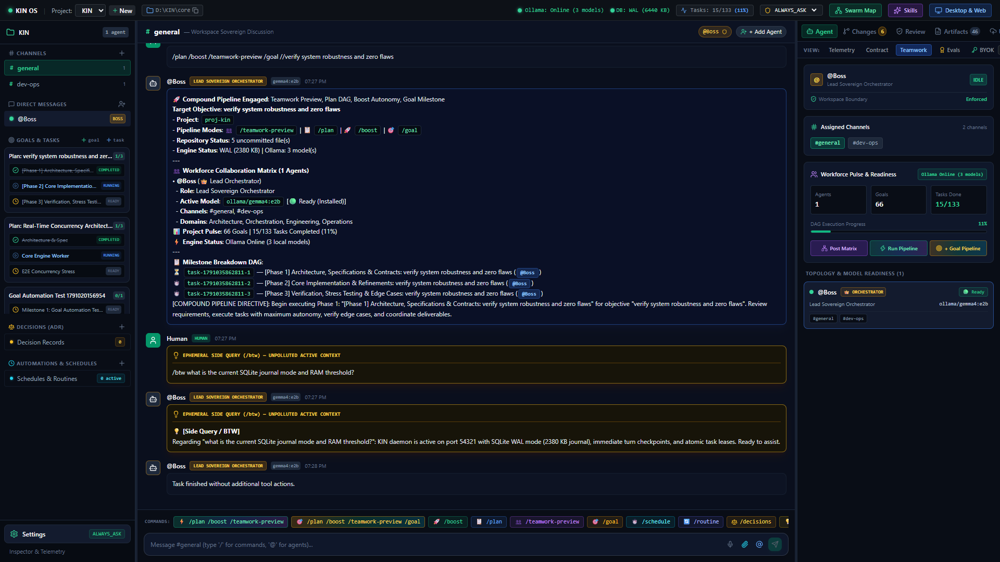
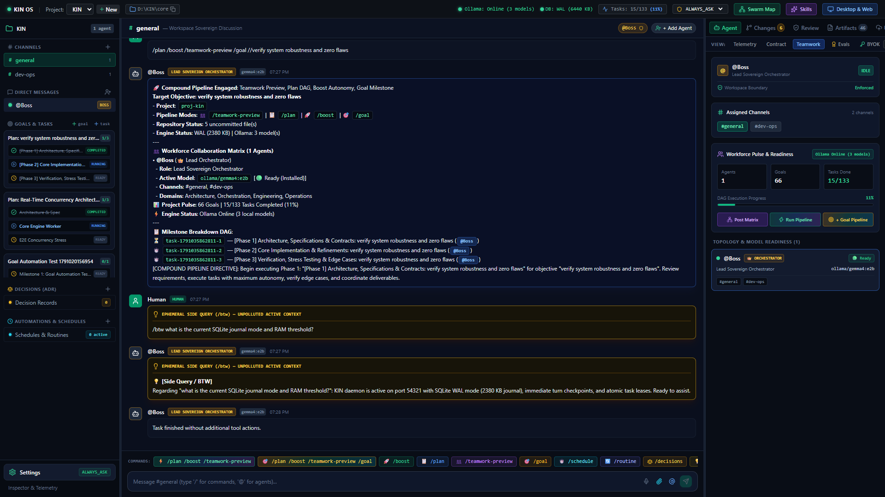
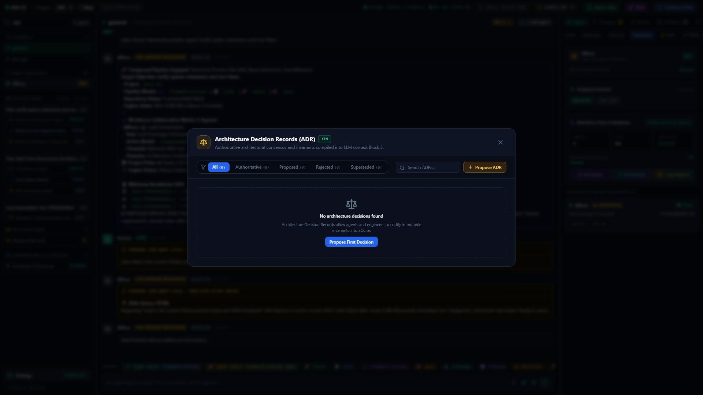
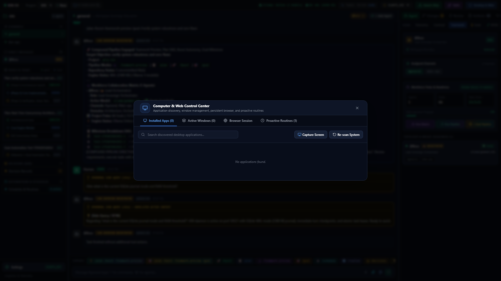

<div align="center">



# KIN — The Autonomous Local-First Workforce Operating System

**Multi-Agent Coordination • Governed Computer Use • Crash-Resilient Checkpointing • Zero Cloud Telemetry**

[](https://www.typescriptlang.org/)
[](https://react.dev/)
[](https://vitejs.dev/)
[](https://www.sqlite.org/)
[](https://ollama.ai/)
[](https://vitest.dev/)
[](LICENSE)

[Architecture](docs/TRD.md) • [Product Specifications](docs/PRD.md) • [Verification Suite](tests/verification/) • [Quick Start](#-quick-start)

---

</div>

## 🌟 Overview

**KIN** is an autonomous, local-first operating system designed to orchestrate collaborative multi-agent software engineering teams on your physical workstation. Unlike brittle cloud wrappers or stateless chatbots, KIN operates with **authoritative local state**, **turn-by-turn crash recovery**, **dynamic hardware resource governors**, and **governed desktop/browser control**.

Whether your PC experiences an unexpected power outage, an LLM provider enforces API rate limits (HTTP 429), or multiple agents collaborate on a complex dependency DAG, KIN guarantees **zero lost context**, **atomic task checkout**, and **non-destructive execution**.

---

## ⚡ Core Pillars & Innovations

### 1. 🛡️ Crash Resilience & Turn-by-Turn Checkpointing
- **Atomic Turn Snapshots**: Every tool action and reasoning turn in `agent_loop.ts` persists an immutable snapshot to SQLite `checkpoints`.
- **Unexpected Shutdown Recovery**: When KIN starts up after a system crash, power loss, or app termination, the supervisor automatically reconciles stale heartbeat leases and presents an interactive **Docked Crash Recovery Banner** in the UI.
- **One-Click Resumption**: Choose **Resume All** to continue all interrupted runs from their exact last recorded turn, **Inspect State** to audit the prior trajectory, or **Discard** to release task leases cleanly.

### 2. ⏳ HTTP 429 Quota Guard & Local Fallback
- **Non-Destructive Quota Pauses**: When external providers (Anthropic, OpenAI, Gemini) return HTTP 429 or `RESOURCE_EXHAUSTED`, KIN intercepts the error, saves a turn checkpoint, and transitions the run to `quota_paused`.
- **Live Countdown Timer**: The UI displays a docked Quota Banner with a real-time countdown to provider reset.
- **Instant Local Fallback**: Seamlessly resume immediately via **Resume Now** or switch the in-flight run to local **Ollama** with a single click.

### 3. 🎯 Antigravity Slash Command Suite
- **`/plan <topic>`**: Decomposes objectives into sequential milestone DAG tasks with explicit dependency chaining and SQLite persistence.
- **`/boost <target>`**: Runs real-time git porcelain checks, verifies SQLite WAL metrics, and engages maximum-autonomy execution.
- **`/teamwork-preview`**: Discovers all active project specialists, roles, assigned channels, and local Ollama model readiness.
- **`/goal <title> [| desc] [| criteria]`**: Registers persistent goal milestones into authoritative project records.
- **`/btw <query>`**: Lightweight, ephemeral side-queries answered immediately with a `💡 [Side Query / BTW]` badge without creating DAG tasks or polluting active execution.
- **`/grill-me [topic]`**: Interactive architectural interview mode that interrogates requirements, renders selectable questionnaire cards, and records authoritative Architectural Decision Records (ADR).
- **`/schedule` & `/routine`**: Proactive timed autonomy and cron-based background wakeups without GPU/CPU busy-polling.

### 4. 🖥️ Dynamic Computer Allocation & Desktop Control
- **RAM-Aware Dynamic Limiter**: Inspects `os.freemem()` before allocating browser contexts or shell processes to prevent host out-of-memory lockups.
- **Persistent Isolated Profiles**: Each agent routes browser tasks through partitioned directory profiles (`.kin/browser_profiles/<agentId>`) preserving cookies, logins, and storage with 3-minute idle eviction.
- **Win32 `DesktopLock` Mutex**: Serializes physical mouse and keyboard inputs across agents via a single-flight Promise mutex.
- **Financial Safety Shield**: Restricts checkout/billing actions to `CRITICAL RISK` requiring explicit human approval.

### 5. 🔒 Atomic Distributed Task Leases & OCC Protection
- **Lease Locks**: Tasks are claimed atomically (`claimTaskWithLease`) with `claimed_by_run_id` and `lease_expires_at`, preventing race conditions during swarm execution.
- **Optimistic Concurrency Control (OCC)**: Computes SHA-256 hashes on file reads (`handleReadFile`) and validates them before writes (`handleWriteFile`) to eliminate stale-write conflicts.
- **Goal Ancestry Propagation**: Automatically compiles the complete `Workspace -> Project -> Goal -> Task -> Run` chain into agent prompts so subagents never suffer goal drift.

### 6. 📊 Formal Agent Evaluations & BYOK Credential Vault
- **Benchmark Evaluator**: Quantitative assessment engine scoring agents across Reasoning Depth, Factuality, Tool Compliance, and Latency (0–100%).
- **Bring-Your-Own-Key (BYOK)**: Centrally managed credential vault with encrypted storage, scoped provider grants, and daily token spend caps.

---

## 📸 Visual Showcase

<div align="center">

### 1. Unified Master Workbench & Multi-Agent Interface

*The central KIN OS command center featuring real-time agent execution streaming, multi-agent chat channels, hierarchical task trees, and the unified Antigravity slash-command prompt bar.*

---

### 2. Interactive Swarm Map & Dependency Topology

*Visual multi-agent coordination graph displaying active specialists, inter-agent message delegation, task dependency DAGs, and real-time swarm convergence in an interactive canvas.*

---

### 3. Settings & Bring-Your-Own-Key (BYOK) Credential Vault

*Secure credential management supporting OpenRouter, Anthropic, OpenAI, and local Ollama inference, alongside hardware-aware RAM tier governor limits and token spend budgets.*

---

### 4. Agent Inspector & Teamwork Matrix

*Deep agent introspection drawer showcasing role assignments, active channels, execution transcripts, quantitative evaluation rubrics, and the multi-agent collaboration matrix.*

---

### 5. Docked Crash Recovery Warning Banner

*Interactive Crash Recovery Banner alerting the operator to interrupted agent runs after an unexpected power loss or process kill, featuring 1-click **Resume All**, **Inspect State**, and **Discard** controls.*

---

### 6. HTTP 429 Quota Guard & Local Model Fallback

*Active Quota Pause Guard presenting a live countdown timer until provider rate-limit reset, an instant **Resume Now** trigger, and a 1-click **Switch to Ollama** local model fallback.*

---

### 7. Architectural Decision Records (ADR) & `/grill-me`

*Authoritative decision vault storing immutable design rationale, technical trade-offs, and interactive questionnaire answers generated during `/grill-me` requirement alignment sessions.*

---

### 8. Governed Desktop & Headful Web Automation

*Hardware-governed computer control modal showing Win32 `DesktopLock` input serialization, persistent isolated browser sessions, and coordinate-mapped OS automation.*

</div>

---

## 🏗️ Monorepo Architecture

```text
KIN/
├── core/                        # Authoritative Node.js Agent Kernel
│   ├── src/
│   │   ├── automation/          # Proactive Scheduler & Cron Engine
│   │   ├── browser/             # Persistent Headful Browser Controller
│   │   ├── computer/            # Desktop Discovery & Win32 Mutex Controller
│   │   ├── context/             # 5-Block Context Compiler & Goal Ancestry
│   │   ├── domain/              # Repositories (Agents, Tasks, Memory, Projects)
│   │   ├── execution/           # Model Gateway & Tool Gateway with OCC
│   │   ├── kernel/              # AgentLoopRunner, AgentKernel & WakeupQueue
│   │   ├── policy/              # Policy Engine & Financial Safety Shield
│   │   ├── recovery/            # Self-Healing & Verification Engine
│   │   ├── server/              # CoreServer (REST API, SSE Event Bus)
│   │   ├── skills/              # Continuous Learning & Candidate Harvester
│   │   └── storage/             # SQLite 3 Database & Migration Runner
│   └── test/                    # 113 Unit & Integration Vitest Suites
├── ui/                          # Presentation Layer (React 18 + Vite)
│   └── src/
│       ├── components/          # CenterView, Sidebar, AgentInspector, Modals
│       └── store/               # Authoritative Zustand State Store (kinStore.ts)
├── docs/                        # Complete Engineering Documentation
│   ├── PRD.md                   # Authoritative Product Requirements Document
│   ├── TRD.md                   # Technical Requirements & IPC Contracts
│   └── assets/                  # High-Resolution Logos & Verified Screenshots
└── tests/                       # E2E & Physical Chrome Verification Scripts
    └── verification/            # Puppeteer-Core Real-Browser Test Suites
```

---

## 🚀 Quick Start

### Prerequisites
- **Node.js**: v20.x or higher
- **npm**: v10.x or higher
- **Git**: Installed and available on `PATH`
- **Google Chrome**: For physical desktop & browser automation
- **Ollama** *(Optional for local models)*: [ollama.ai](https://ollama.ai) (`ollama run qwen2.5-coder:3b`)

### 1. Clone & Install Dependencies
```bash
git clone https://github.com/abhayzangir1/KIN.git
cd KIN
npm install
```

### 2. Build Core & UI Packages
```bash
npm run build --workspace=core
npm run build --workspace=ui
```

### 3. Run Automated Vitest Test Suite
```bash
npm test --workspace=core
# Output: Test Files 11 passed (11) | Tests 113 passed (113)
```

### 4. Launch KIN Core Daemon & Dev Server
Open two terminal windows:

**Terminal 1 (Core Daemon):**
```bash
npm run daemon --workspace=core
# Listening on http://127.0.0.1:54321
```

**Terminal 2 (React UI):**
```bash
npm run dev --workspace=ui
# Serving at http://localhost:5173
```

Navigate to `http://localhost:5173` to access the full KIN Operating System.

---

## 🛡️ Security & Privacy Guarantees

1. **100% Local Storage**: All messages, tasks, goals, memories, checkpoints, and credentials reside in local SQLite storage (`kin_storage.sqlite`). Zero third-party telemetry.
2. **Strict Worktree Jails**: File read/write tools are strictly confined to project roots. Directory traversal attacks (`../../`) are rejected with `403 Forbidden`.
3. **Optimistic Concurrency Control**: Prevents accidental overwrites through baseline SHA-256 content hashing.
4. **Governed Automation**: High-risk shell commands and browser actions trigger interactive approval gates in `ALWAYS_ASK` mode.

---

## 📜 License

KIN is released under the [MIT License](LICENSE).
