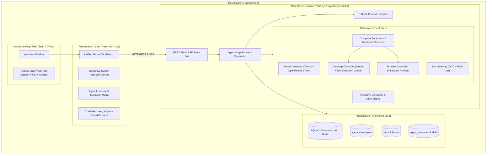
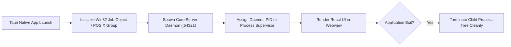
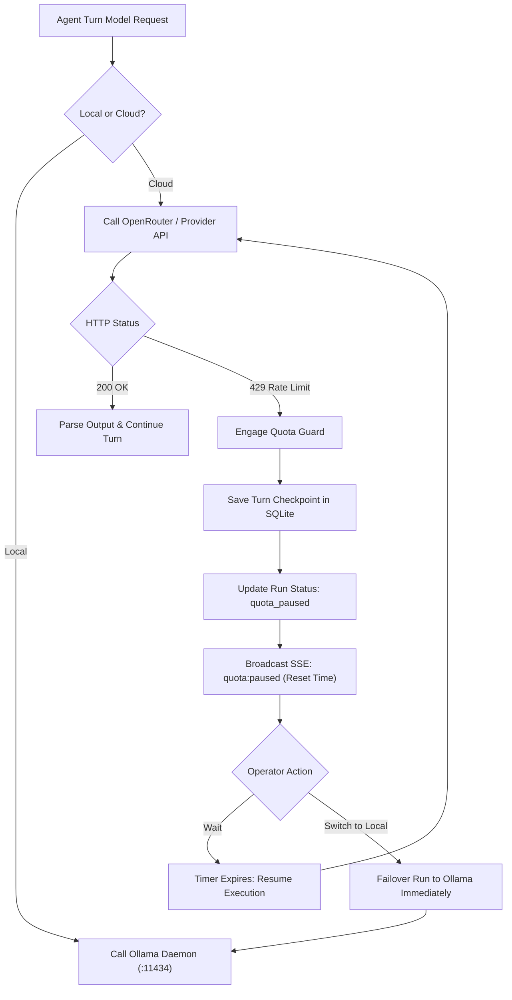
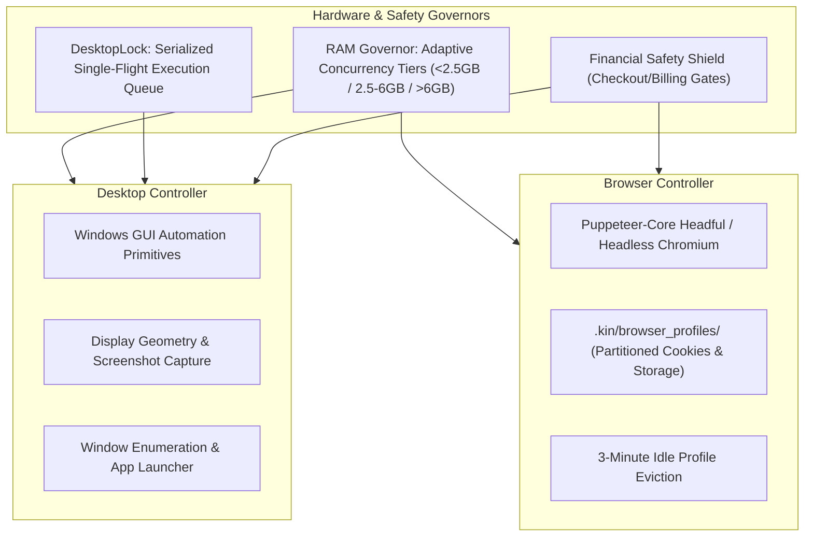
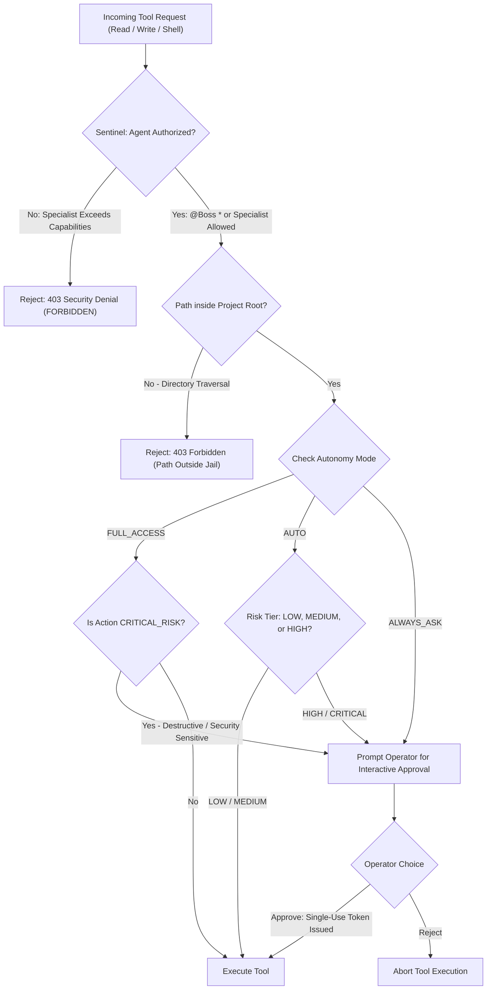

# KIN Architecture Specification

**Authoritative Technical Blueprint • Multi-Agent Autonomous Workforce Platform**

---

## 1. Product Core, Vision & Real-World Use Cases

### 1.1 Product Core
**KIN** is a sovereign, local-first autonomous AI workforce and multi-agent coordination platform. Rather than functioning as a remote chatbot wrapper or relying on ephemeral cloud infrastructure, KIN enables users to **swarm custom autonomous agents for any workload** directly on their physical workstations — including deep research, daily operational routines, web automation, data analysis, and software engineering.

KIN operates with **authoritative local state**, **turn-by-turn crash recovery**, **hardware-aware resource governors**, and **governed desktop/browser automation**. It stands as a private, local-first alternative to closed cloud ecosystems like **ChatGPT Dots** (OpenAI) and **Grok Bots** (xAI), providing persistent agentic teammates with zero monthly subscriptions, zero cloud lock-in, and zero telemetry.

### 1.2 Vision & Principles
- **Universal Multi-Domain Swarms**: Users can spawn and orchestrate specialist agent teams across any discipline — research analysts, operations managers, social media coordinators, executive assistants, or software engineers.
- **Local Sovereignty**: All code, tasks, goals, memories, checkpoints, and credentials reside on the host machine in SQLite with Write-Ahead Logging (WAL). Zero telemetry is transmitted to third parties.
- **Turn-by-Turn Crash Resilience**: Every reasoning step and tool invocation records an immutable checkpoint. Following unexpected power loss or process termination, interrupted runs resume from their exact recorded state.
- **Hardware-Governed Autonomy**: Dynamic memory governors and input mutex locks serialize access to physical resources, preventing out-of-memory lockups and concurrent input contention.
- **Deterministic Multi-Agent Coordination**: Agents operate within strict domain boundaries, claim tasks via atomic distributed leases, work in isolated git worktrees, and communicate over structured channels.

### 1.3 Real-World Use Cases
1. **Deep Research & Intelligence Swarms**:
   - Synthesizing multi-source technical and market literature into structured intelligence dossiers.
   - Extracting structured data from PDFs, documents, and web portals with verifiable citations.
2. **Proactive Personal Routines & Daily Operations**:
   - Running background cron routines (`/routine`) and timed alarms (`/schedule`) for morning briefings, repository health audits, and inbox summaries without CPU/GPU busy-polling.
3. **Web & Social Platform Workflow Automation**:
   - Running persistent, partitioned browser sessions with session persistence (cookies and local storage).
   - Automating communication on developer platforms, social platforms (X, LinkedIn), Slack, or Discord with operator supervision.
   - Extracting documentation, tracking issues, and submitting pull requests.
4. **Hardware-Governed Desktop Control**:
   - Inspecting active GUI windows and display geometry.
   - Automating desktop tasks using serialized mouse, keyboard, and coordinate-mapped actions with the serialized single-flight execution queue with native window focus management.
   - Enforcing human confirmation barriers for sensitive actions (e.g., checkout flows, credential access).
5. **Full-Lifecycle Software Engineering & Data Analysis**:
   - Decomposing architectural requirements into milestone DAG tasks with `/plan`.
   - Provisioning isolated git worktrees for parallel feature development.
   - Performing automated peer code reviews and executing test suites locally.

---

## 2. High-Level System Architecture

KIN employs a decoupled, multi-tier architecture consisting of:
1. **Native Desktop Shell** (Tauri 2 / Rust): Manages the window lifecycle, hardware process supervision, and native operating boundaries.
2. **Authoritative Core Server Daemon** (Node.js / TypeScript): Hosts the central REST API, Server-Sent Events (SSE) event bus, task dependency graph, and agent execution engine.
3. **Persistence Layer** (SQLite 3 with WAL Mode): Manages authoritative state, task leases, and turn checkpoints.
4. **Hardware & Execution Gateway**: Manages model routing (Ollama and OpenRouter), tool sandboxing, git worktrees, and computer/browser automation.
5. **Presentation Layer** (React 18 / Vite / Zustand): Provides the operator workbench, real-time streaming, interactive swarm visualization, and control modals.



---

## 3. Subsystem Deep Dive & Execution Lifecycles

### 3.1 Hybrid Native Desktop Shell (Tauri 2 + Rust)
The native shell (`src-tauri/`) provides the desktop application container and process isolation boundaries:
- **Process Trees**: On Windows, the shell registers child processes into a Win32 **Job Object** with `JOB_OBJECT_LIMIT_KILL_ON_JOB_CLOSE`. When the application window closes, all spawned background daemons and browser instances terminate cleanly. On Unix and macOS, POSIX process group signaling achieves equivalent isolation.
- **Path Jail Validation**: Native path verification (`src-tauri/src/jail.rs`) validates that filesystem operations remain confined to operator-designated project directories.



---

### 3.2 Authoritative Core Server & IPC Protocol
The Core Server (`core/src/server/core_server.ts`) acts as the single source of truth across the platform:
- **Master State Aggregation (`GET /api/state`)**: Provides unified workspace reconciliation for frontend mounting, bundling active projects, channels, agent analytics, active tasks, goals, decisions, pending approvals, and system telemetry in a single atomic payload.
- **REST Endpoints**: Comprehensive CRUD operations for projects, agents, channels, messages, goals, tasks, schedules, decisions, skills, and system health diagnostics (`/api/system/health`).
- **Server-Sent Events (`/api/events`)**: Streams live events (`message:created`, `task:updated`, `agent:step`, `system:governor`, `quota:paused`) over HTTP with an initial `: connected` handshake and persistent keep-alives.
- **Port Management & Loopback Security**: Binds to loopback `127.0.0.1:54321` guarded by bearer token authentication (`.kin/ipc_auth.token`) and strict CORS origins.

---

### 3.3 Authoritative State & Turn-by-Turn Checkpointing
All platform state resides in `kin_storage.sqlite` managed through Node.js's native built-in `node:sqlite` (`DatabaseSync`), requiring zero external C++ build toolchains or node-gyp bindings. The database is initialized with Write-Ahead Logging (`PRAGMA journal_mode = WAL;`), immediate write consistency (`PRAGMA synchronous = NORMAL;`), 10-second busy timeout (`PRAGMA busy_timeout = 10000;`), and foreign key enforcement (`PRAGMA foreign_keys = ON;`).

#### Production Schema Architecture (30 Tables):
- **Workspaces & Routing**: `workspaces`, `projects`, `channels`, `channel_members`, `messages`, `event_journal`.
- **Agent Workforce**: `agent_definitions`, `agent_identities`, `agent_runs`, `agent_evaluations`, `checkpoints`.
- **Goals & Execution DAG**: `goals`, `tasks`, `task_dependencies`, `decisions`, `evidence`.
- **Security & Governed Operations**: `approvals`, `action_records`, `managed_credentials`, `file_revisions`.
- **Skills & Institutional Memory**: `skills`, `skill_experiences`, `skill_versions`, `memories`, `memory_versions`.
- **Automation & Telemetry**: `schedules`, `models`, `providers`, `sqlite_sequence`, `sqlite_stat1`.

#### Turn-by-Turn Checkpoint Lifecycle:
1. When an agent receives an execution turn in `agent_loop.ts`, it compiles active context and queries the Model Gateway.
2. After the model responds with reasoning and proposed tool calls, the runner writes an immutable record into `checkpoints`:
   - `id`, `run_id`, `snapshot_json`, `worktree_commit_sha`, `created_at`.
3. Concurrently, `agent_runs` updates its `heartbeat_at`, `used_tokens`, and `state` (`running`, `completed`, `quota_paused`, `failed`).
4. If an unhandled exception, power outage, or external process termination occurs, the database retains the last completed turn.
5. On startup, `CoreServer` inspects `agent_runs` for records with state `running`. Stale runs trigger the **Docked Crash Recovery Banner** in the user interface.

```mermaid
sequenceDiagram
    autonumber
    actor Operator as Operator
    participant UI as React UI (Workbench)
    participant Core as Core Server Daemon
    participant Loop as Agent Loop Runner
    participant DB as SQLite 3 (WAL)
    participant Model as Model Gateway

    Operator->>UI: Submit Task or Slash Command
    UI->>Core: POST /api/channels/:id/messages
    Core->>DB: Persist Message & Update Task Status
    Core->>Loop: Dispatch Agent Turn
    Loop->>DB: Claim Task Lease (claimed_by_run_id)
    Loop->>Model: Invoke Model (Ollama / OpenRouter)
    Model-->>Loop: Stream Response & Tool Proposals
    Loop->>DB: Write Immutable Turn Checkpoint (agent_checkpoints)
    Loop->>Core: Execute Tools & Update Task State
    Core->>UI: Stream SSE Event (agent:step, task:updated)
```

---

### 3.4 The 5-Block Context Compiler
Before every reasoning turn, `ContextCompiler` (`core/src/context/context_compiler.ts`) synthesizes active workspace data into a strict 5-block prompt designed for maximum KV-cache reuse:

```text
┌─────────────────────────────────────────────────────────────┐
│ BLOCK 1: Agent Identity & Strategic Goal Ancestry           │
│ Role, system prompt, invariants, Project ➔ Goal ➔ Task       │
├─────────────────────────────────────────────────────────────┤
│ BLOCK 2: Tool Schemas (Cacheable Prefix)                    │
│ Parameter specifications, tool names, required attributes   │
├─────────────────────────────────────────────────────────────┤
│ BLOCK 3: Project Grounding & Architectural Decision Records  │
│ Invariant conventions, coding rules, ADR rationale          │
├─────────────────────────────────────────────────────────────┤
│ BLOCK 4: Context Compaction & Learned Experiences           │
│ Compacted history, error repair strategies, skills recipes  │
├─────────────────────────────────────────────────────────────┤
│ BLOCK 5: Dynamic Turn Trajectory & Step Observations        │
│ Active messages, tool outputs, baseline SHA-256 OCC hashes  │
└─────────────────────────────────────────────────────────────┘
```

- **KV Cache Optimization**: Blocks 1 through 3 are static or semi-static prefixes that maximize token cache hit rates on modern providers. Dynamic turn mutations and file observations are strictly isolated to Block 5.
- **Goal Ancestry Propagation**: Subagents inherit the full hierarchy `Workspace -> Project -> Goal -> Task -> Run`, preventing objective drift during complex multi-agent execution.
- **Optimistic Concurrency Control (OCC)**: Tool outputs for read operations inject baseline SHA-256 hashes. Subsequent write operations verify hashes before writing, preventing accidental overwrites.

---

### 3.5 Model Gateway & Quota Guard Architecture
`ModelGateway` (`core/src/execution/model_gateway.ts`) abstracts model providers:
- **Local Inference**: Native connectivity to local **Ollama** instances (`http://localhost:11434`), supporting local models like `qwen2.5-coder:3b` and `llama3.2`.
- **Cloud BYOK (Bring Your Own Key)**: Direct integration with OpenRouter, Anthropic, OpenAI, DeepSeek, and Google Gemini with token spend tracking and configurable spend caps.
- **Quota Guard (HTTP 429 Interception)**:
  1. When a cloud provider returns HTTP 429 (`RESOURCE_EXHAUSTED` or rate limit exceeded), the gateway catches the error.
  2. The agent run is updated to status `quota_paused`, and an immutable checkpoint is saved.
  3. The Core Server emits a `quota:paused` event to the UI, rendering a live countdown timer until quota reset.
  4. The operator can wait for automatic resumption or click **Switch to Ollama** to immediately failover to a local model without lost context.



---

### 3.6 Governed Computer & Browser Automation Subsystem
The computer control subsystem provides safe, hardware-governed desktop and browser automation:



1. **Adaptive RAM Governor**:
   - `ComputerSupervisor` continuously evaluates host free memory to enforce adaptive execution tiers:
     - `low` (< 2.5 GB free RAM): Limits concurrency to 1 active browser context and 1 shell process.
     - `medium` (2.5 – 6.0 GB free RAM): Limits concurrency to 2 active browser contexts and 2 shell processes.
     - `high` (> 6.0 GB free RAM): Scales up to 3 active browser contexts and 4 shell processes.
   - If host memory falls critically low (< 300 MB), `WakeupQueue` automatically injects a 2000ms delay to prevent host lockup and allow garbage collection.
2. **Serialized Single-Flight Execution Queue**:
   - Physical mouse and keyboard inputs are serialized across concurrent agents using native window focus management.
   - Prevents interleaved keystrokes or clashing mouse clicks during multi-agent workflows.
3. **Partitioned Persistent Browser Profiles**:
   - Each agent maintains an isolated profile directory (`.kin/browser_profiles/<agentId>`).
   - Browser cookies, sessions, and web logins persist between commands.
   - Inactive browser instances are automatically evicted after 3 minutes of idle time to conserve system memory.
4. **Financial Safety Shield**:
   - Actions matching payment, billing, or checkout patterns are classified as `CRITICAL_RISK`.
   - The platform pauses execution and requires explicit operator confirmation before proceeding.

---

### 3.7 Slash Command Engine & Multi-Command Pipelines
KIN provides a unified slash command router (`core/src/server/core_server.ts`) supporting single and compound commands:

| Slash Command | Primary Action | System Effect |
| :--- | :--- | :--- |
| `/plan <topic>` | Decomposes topic into sequential milestones | Creates a Goal and chained Task DAG in SQLite; dispatches Phase 1 task |
| `/boost <target>` | Engages maximum-autonomy execution | Checks git porcelain status, SQLite WAL metrics, and Ollama readiness |
| `/teamwork-preview` | Renders live workforce status | Queries active agents, channel assignments, and model installation states |
| `/goal <title> [\| desc]` | Registers an authoritative goal | Writes to SQLite `goals` table with structured acceptance criteria |
| `/schedule <duration>` | Sets a non-busy-polling timer | Registers one-shot timer in `SchedulerEngine`; sleeps until event fires |
| `/routine <cron \| sec>` | Configures a recurring routine | Registers periodic cron routine for continuous background execution |
| `/btw <query>` | Ephemeral side-query | Fast-path query execution without creating tasks or polluting DAG history |
| `/grill-me [topic]` | Adversarial architecture inquiry | Launches an interactive architectural questionnaire to forge ADR records |
| `/decisions` or `/adr` | Architecture Decision Records | Lists or proposes immutable ADR entries in SQLite `decisions` table |
| `/skills` | Lists registered capabilities | Inspects registered tool extensions and continuous learning skill catalog |
| `/hire <role> [name]` | Recruits a specialist agent | Creates an agent definition and identity with custom domain authority |

#### Compound Multi-Command Pipeline:
Commands can be compounded into a single prompt:
```text
/plan /boost /teamwork-preview /goal Build Real-time Analytics | Dashboard, API, Tests | Zero regressions
```
The router parses pipe criteria (`|`), sets up goals and tasks, verifies git and engine health, displays the workforce matrix, and begins execution in a unified sequence.

---

### 3.8 Origin-Aware Goals & Interactive Replanning
KIN implements a rich goal tracking and replanning protocol:
1. **Enriched Goal Schema**: Goals in SQLite track `deadline`, `check_in_policy`, `progress_summary`, `blocked_state`, `proposed_replanning_json`, and `origin_channel_id`.
2. **DM-to-Channel Boundary Elevation**: When cross-cutting or shared project objectives are requested in direct messages, the specialist announces the scope in `#general`, where `@Boss` establishes the authoritative Goal and Task DAG.
3. **Interactive Plan Decisions (`[DECISION_CARD]`)**: When an agent detects blocker conditions or proposes an architectural change via the `proposePlanAdjustment` tool, KIN formats the proposal into a structured `[DECISION_CARD]` rendered by `DecisionCard.tsx` in the Workbench chat.
4. **Authoritative ADR Adoption**: When the operator clicks **Choose Option A**, **Choose Option B**, or **Apply Compromise**, `/decisions choose <choice>` records an authoritative Architecture Decision Record and advances active goal progress.

---

## 4. Security, Isolation & Safety Boundaries



1. **Sentinel Security Boundary & Hierarchical Attenuation**:
   - Every tool execution passes through `Sentinel.evaluate()`.
   - **Hierarchical Attenuation**: `@Boss` retains platform authority (`*`), while specialist agents are strictly confined to their declared capability sets (e.g. `['fs:read', 'fs:write']`, `['web:browse']`, `['mcp:call']`).
   - Unauthorized tool calls are rejected fail-closed with `SECURITY DENIAL: FORBIDDEN`.
2. **Secret Vault & Parameter Redaction**:
   - API keys and tokens in `managed_credentials` are encrypted using AES-256-GCM (`SecretVault`).
   - `SecretBroker.sanitizePayload()` automatically strips passwords, tokens, and secrets from `action_records.params_json` and `approvals.action_payload_json` prior to SQLite storage.
3. **Loopback IPC Token Authentication**:
   - Port `54321` enforces bearer token authentication via `.kin/ipc_auth.token`.
   - Requests from untrusted browser tabs or third-party localhost processes lacking the secret token receive `401 Unauthorized`.
4. **Subprocess & Browser Isolation**:
   - Subprocesses spawned by MCP clients run in sanitized environments stripped of host credentials (`*_API_KEY`, `KIN_*`).
   - Browser automation disallows `file:` and `data:` scheme traversals without explicit administrative capabilities.
5. **Strict Project Worktree Jail**:
   - Filesystem tools resolve paths relative to the active project root using canonical path evaluation. Path traversal (`../`) outside the boundary is blocked.
6. **Git Worktree Isolation**:
   - Concurrent tasks execute in dedicated git worktrees (`.kin/worktrees/<task-id>`), preventing file write conflicts between agents.
7. **Optimistic Concurrency Control (OCC)**:
   - Tool writes verify SHA-256 hashes recorded during previous reads. If the file has changed on disk, the write is rejected to prevent silent overwrites.
8. **Financial Safety Shield**:
   - Desktop and browser actions that encounter checkout, credit card, or payment triggers are blocked until confirmed by the operator.

---

## 5. Directory Layout & Key Modules

```text
KIN/
├── core/                                # Authoritative Node.js Agent Kernel
│   ├── src/
│   │   ├── automation/                  # Proactive Scheduler & Cron Engine
│   │   ├── browser/                     # Persistent Headful Browser Controller
│   │   ├── computer/                    # Desktop Automation & Single-Flight Execution Queue
│   │   ├── context/                     # 5-Block Context Compiler & Goal Ancestry
│   │   ├── domain/                      # SQLite Repositories (Agents, Goals, Tasks, Memory)
│   │   ├── execution/                   # Model Gateway & Tool Gateway with OCC
│   │   ├── kernel/                      # AgentLoopRunner, AgentKernel & Checkpointing
│   │   ├── policy/                      # Policy Engine & Financial Safety Shield
│   │   ├── recovery/                    # Self-Healing & Verification Engine
│   │   ├── security/                    # Sentinel, SecretVault (AES-256) & SecretBroker
│   │   ├── server/                      # CoreServer (REST API, SSE Event Bus, IPC Auth)
│   │   ├── skills/                      # Skill Engine & Experience Harvester
│   │   └── storage/                     # SQLite 3 Database & Migration Runner
│   └── test/                            # 13 Unit & Integration Vitest Suites (161 Tests)
├── ui/                                  # Presentation Layer (React 18 + Vite)
│   └── src/
│       ├── components/                  # Workbench, SwarmMap, DecisionCard, Modals
│       └── store/                       # Authoritative Zustand State Store (kinStore.ts)
├── src-tauri/                           # Native Desktop Shell (Tauri 2 / Rust)
│   ├── src/
│   │   ├── lib.rs                       # Tauri Application Builder & IPC Bridge
│   │   ├── supervisor.rs                # Win32 Job Object & POSIX Process Supervisor
│   │   └── jail.rs                      # Native Path Validation
│   ├── Cargo.toml                       # Rust Dependencies (tauri 2.2, tokio, windows-rs)
│   └── tauri.conf.json                  # Multi-Platform Window & Bundle Configuration
└── docs/                                # Technical & Architectural Documentation
    ├── ARCHITECTURE.md                  # This Technical Architecture Specification
    ├── PRD.md                           # Product Requirements Document
    ├── TRD.md                           # Technical Requirements & IPC Contracts
    └── assets/                          # Platform Logos & Interface Visuals
```
