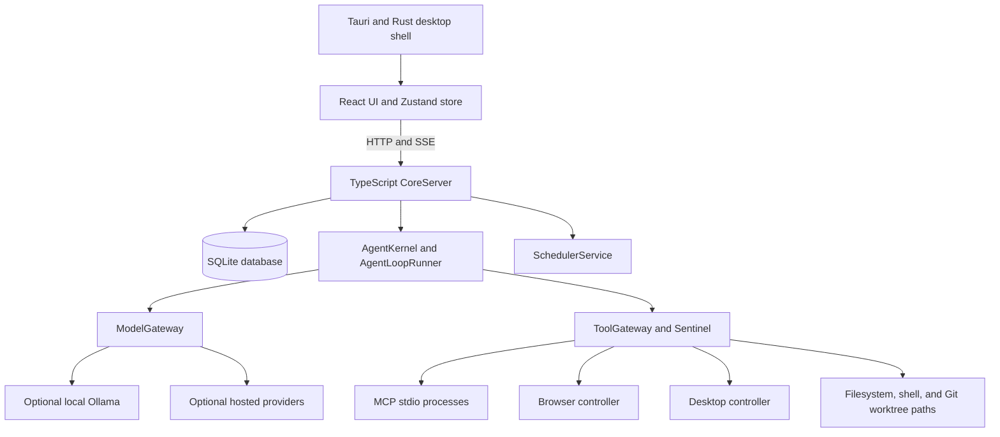

# KIN architecture

This document summarizes the architecture represented by the current source. It describes code boundaries, not a guarantee that every subsystem is complete or verified in a packaged application. See [Current implementation notes](PROJECT_STATUS.md) for scope and limits. Product and technical requirements are maintained separately in [PRD](PRD.md) and [TRD](TRD.md).

## Runtime overview



## Components

### Desktop and interface

`src-tauri/` contains the Tauri application, Rust startup/supervision code, and platform-specific desktop integration. `ui/` contains the React interface and Zustand store. The UI communicates with the TypeScript core over local HTTP and Server-Sent Events; Tauri packaging and browser-based development are distinct launch modes.

### Core service and persistence

`core/src/server/core_server.ts` constructs and connects the runtime services, starts the local HTTP server, and exposes API routes and SSE events. The default listener uses `127.0.0.1:54321`; the daemon can select another port with `KIN_PORT`.

`core/src/storage/` initializes SQLite and migrations. Domain repositories manage projects, agents, tasks, goals, channels, and memory. The event ledger records structured events. Application state and project files are local by default, while integrations may make external requests.

### Agent execution and context

`AgentKernel` manages run records, run admission, state transitions, and recovery data. `AgentLoopRunner` performs model turns and tool calls. `ContextCompiler` gathers agent, project, task, channel, memory, and skill context. `WakeupQueue` coalesces pending wakeups in process memory; durable run and task state is stored separately.

Task leases coordinate claims in SQLite. The source includes checkpointing and startup recovery paths, but those mechanisms should not be read as exact replay or lossless recovery guarantees.

### Models and credentials

`ModelGateway` handles provider model discovery and inference adapters, including Ollama and configured hosted providers. `SecretVault` and `SecretBroker` manage credentials and secret substitution/redaction paths. Model catalogs and configured-key status do not prove successful inference; the selected provider must accept a real request.

Hosted requests send the prompt and context supplied to that provider off-device. Ollama can run inference locally when available, but other application features may still use network connections.

### Tools and integrations

`ToolGateway` builds tool schemas and dispatches filesystem, shell, scheduling, browser, desktop, skill, and MCP calls. `Sentinel` evaluates tool authorization and approvals. Several direct HTTP control endpoints also exist, so a single gateway diagram should not be interpreted as proof that every privileged action shares one enforcement path.

MCP configuration is read from supported project configuration locations by `McpClientManager`. MCP servers run as child processes and can receive the tool arguments sent to them. Review server commands and configuration before enabling them.

The browser and desktop controllers use host capabilities. A tool approval or project path check is not an operating-system sandbox. Chromium flags, host permissions, and platform behavior affect the actual boundary.

Git worktrees provide a separate working directory for supported coding tasks. They do not isolate child processes, host credentials, or network access.

### Scheduling

`SchedulerService` stores one-shot and recurring schedules in SQLite. Recurring schedules use a five-field cron parser and next-occurrence calculator in `cron_calendar.ts`. The service records dispatch attempts and supports retry paths. Scheduler state does not guarantee that a target model or downstream task will complete successfully.

## Data and trust boundaries

```text
Local UI / Tauri window
        │ local HTTP + SSE
        ▼
CoreServer ───── SQLite and local project files
   │
   ├── Ollama (local service, if configured)
   ├── Hosted model provider (prompt/context leave the machine)
   ├── Browser destination (network request to visited site)
   └── MCP process/service (receives tool arguments)
```

Treat model output, browser content, MCP responses, imported skills, project files, and user-provided prompts as untrusted input. Application-level approvals and capability checks reduce risk but should not be described as a host security boundary.

## Source map

| Area | Main path |
|---|---|
| HTTP/SSE API and service assembly | `core/src/server/core_server.ts` |
| Run state and agent loop | `core/src/kernel/` |
| Domain persistence | `core/src/domain/` |
| SQLite schema and migrations | `core/src/storage/` |
| Model providers | `core/src/execution/model_gateway.ts` |
| Tools and MCP | `core/src/execution/` |
| Authorization and secrets | `core/src/security/` |
| Scheduler | `core/src/automation/` |
| Skills | `core/src/skills/` |
| UI state and components | `ui/src/` |
| Desktop shell | `src-tauri/src/` |
