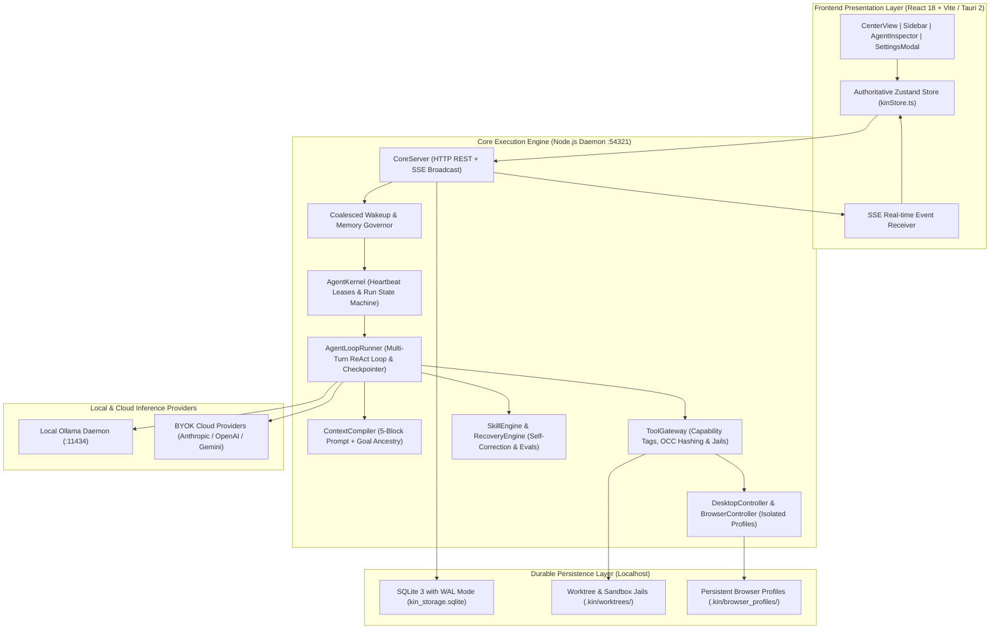

# KIN — Technical Requirements Document (TRD)
## Version 12.0 — System Architecture, IPC Contracts & Engineering Specification

**Document Version:** 12.0  
**Status:** Authoritative Technical Baseline  
**Target Runtimes:** Node.js v20+, TypeScript 5.8+, SQLite 3 (WAL Mode), React 18, Vite 6, Tauri 2, Ollama  
**Operating Systems:** Windows 10/11, macOS, Linux  

---

## 1. System Topology & Architecture

KIN is engineered as a local-first, modular monolith composed of three primary layers operating over ultra-low-latency local IPC:



---

## 2. Authoritative Database Schema & Storage Invariants

All system state is persisted in an authoritative local SQLite database running with `PRAGMA journal_mode = WAL`, `PRAGMA synchronous = NORMAL`, and foreign key enforcement enabled.

### 2.1 Core Schema Entities
1. **Workspaces & Projects**: Root filesystem paths, default autonomy policies (`AUTO`, `ALWAYS_ASK`, `FULL_ACCESS`).
2. **Agent Personas & Identities**: System prompts, default and active models, domain authority arrays, capability tags.
3. **Agent Runs (`agent_runs`)**:
   - `state CHECK (state IN ('created', 'queued', 'running', 'waiting_for_tool', 'waiting_for_approval', 'waiting_for_agent', 'waiting_for_model', 'recovering', 'quota_paused', 'resuming', 'paused', 'completed', 'failed', 'cancelled'))`
   - `heartbeat_at INTEGER NOT NULL`: Enforces 15-second heartbeat leases.
   - `quota_resets_at INTEGER`: Stores backoff expiry for paused runs.
   - `interrupted_turn INTEGER DEFAULT 0`: Checkpoint turn marker for zero-loss recovery.
4. **Goals & Distributed Task Leases (`tasks`)**:
   - `claimed_by_run_id TEXT REFERENCES agent_runs(id) ON DELETE SET NULL`
   - `lease_expires_at INTEGER`: Milliseconds timestamp lease.
   - `retry_count INTEGER NOT NULL DEFAULT 0`: Reclaim failure counter.
5. **Turn Checkpoints (`checkpoints`)**:
   - `run_id`, `turn_index`, `snapshot_json` (serialized messages, tool actions, pending approvals).
6. **Managed Credentials (`managed_credentials`)**:
   - Secure provider credential vault with encrypted keys, scoped capability grants, and daily token spend caps.
7. **Agent Evaluations (`agent_evaluations`)**:
   - Automated benchmark test suites, quantitative scores (0-100), rubric criteria metrics, and evaluator rationale.
8. **Optimistic Concurrency File Revisions (`file_revisions`)**:
   - SHA-256 baseline hashing on file reads to detect external modifications before writes (`StaleWriteConflictError`).
9. **Action Records & Event Journal (`action_records`, `event_journal`)**:
   - Immutable audit trail of every tool call, duration, parameters, risk tier, and operator approval.

---

## 3. Core Execution Lifecycle & Resilience Mechanisms

### 3.1 Turn-by-Turn Checkpointing & Crash Resumption
- **Turn Checkpointing**: After every tool invocation or assistant turn, `AgentLoopRunner` serializes the active conversation trajectory and pending actions to SQLite `checkpoints`.
- **Startup Recovery Sweep**: On daemon initialization, `runSupervisorSelfHealing()` queries for abandoned runs (`heartbeat_at < now - 45s`).
- **Zero-Loss Resumption**: The UI displays a Docked Crash Recovery Banner with 1-click **Resume All**, **Inspect State**, and **Discard** actions. Resumption rehydrates context directly from the SQLite snapshot and continues from turn `N + 1`.

### 3.2 HTTP 429 Quota Guard
- Intercepts `429 Too Many Requests` and `RESOURCE_EXHAUSTED` errors from external providers.
- Transitions run to `quota_paused`, calculates the reset window via `Retry-After` header or exponential backoff, and docks a Quota Pause Banner with live countdown.
- Provides immediate **Resume Now** manual override and **Switch to Local Ollama** 1-click fallback.

### 3.3 Atomic Distributed Task Leases
- Implements `claimTaskWithLease(taskId, agentId, runId, leaseDurationMs)` using atomic SQL:
  ```sql
  UPDATE tasks
  SET status = 'running', assigned_agent_id = ?, claimed_by_run_id = ?, lease_expires_at = ?, updated_at = ?
  WHERE id = ? AND (status IN ('ready', 'backlog') OR (status = 'running' AND lease_expires_at < ?))
  ```
- Expired leases are automatically reclaimed by the supervisor watchdog (`reclaimExpiredTaskLeases`).

### 3.4 Goal Ancestry Propagation
- `ContextCompiler` compiles a 5-block prompt. In Block 1, it injects the authoritative **Goal Ancestry & Objective Anchor**:
  ```
  ### STRATEGIC GOAL ANCESTRY & OBJECTIVE ANCHOR:
  - Workspace: <workspaceName>
  - Project: <projectName> (<repoPath>)
  - Overarching Goal: "<goalTitle>"
  - Goal Acceptance Criteria: <criteria 1>, <criteria 2>
  - Current Active Task: "<taskTitle>"
  - Task Objective: "<taskDescription>"
  ```
- Ensures subagents never suffer goal drift during deep multi-turn delegations.

### 3.5 Event-Driven Coalesced Wakeup Queue
- `WakeupQueue` enforces a 1000ms coalescing window per `agentId:channelId` pair to merge duplicate wakeup calls.
- Interrogates `ComputerSupervisor` and `os.freemem()` before dispatching; if free RAM drops below 500MB, dispatch is queued to prevent OS out-of-memory thrashing.

---

## 4. Antigravity Slash Command Specification

| Command | Syntax & Delimiters | Behavior | Task Creation |
|---|---|---|---|
| `/plan` | `/plan[:\n\s]<objective> [\| step1 \| step2]` | Decomposes objective into milestone DAG tasks in SQLite and begins Phase 1 | Yes (DAG tasks) |
| `/boost` | `/boost[:\n\s]<target>` | Verifies git working tree, WAL stats, and engages maximum autonomy execution | Yes (Audit task) |
| `/teamwork-preview` | `/teamwork-preview[:\n\s]` or `/teamwork` | Discovers all project specialists, active models, channel assignments, and project pulse | No |
| `/goal` | `/goal[:\n\s]<title> [\| desc] [\| criteria]` | Creates persistent goal milestone and initializes first ready task | Yes (Initial task) |
| `/btw` | `/btw[:\n\s]<query>` | Ephemeral side-query; runs single-turn inference with `💡 [Side Query / BTW]` badge | No |
| `/grill-me` | `/grill-me[:\n\s]<topic>` | Interactive architectural interview; renders selectable questionnaire card saving to ADR decisions | Yes (ADR decision) |
| `/schedule` | `/schedule[:\n\s]<time>[s\|m\|h] <prompt>` | Non-blocking one-shot timer; wakes agent automatically without polling loop | Yes (Schedule item) |
| `/routine` | `/routine[:\n\s]<interval\|cron> <prompt>` | Proactive recurring cron or interval routine with automated awakening | Yes (Routine item) |

> **Concurrency & Input Guarantees:**
> - **Channel Queue Lock (`channelQueues`)**: `isAgentActiveInChannel` evaluates active executions AND queued channel promises, preventing incoming burst messages from stampeding duplicate execution loops before an active execution record is registered.
> - **Flexible Delimiters**: All slash commands support whitespace (` `), colon (`:`), and newline (`\n`) as argument separators.
> - **Keyboard Interaction**: In the UI composer, pressing `Tab` autocompletes the selected slash command into the input field so users can append parameters/directives; pressing `Enter` directly triggers execution or opens dedicated modals.

---

## 5. Security & Privacy Guarantees

1. **Strict Path Jail Confinement**: All file read/write operations validate that the resolved target path is strictly within the project jail root. Directory traversal (`../`) and prefix collisions are rejected with 403 Forbidden.
2. **Financial Safety Shield**: Sensitive operations (`stripe`, `billing`, checkout buttons) trigger the Human Authorization Protocol and halt execution until explicit operator signoff.
3. **Opt-in Computer Automation**: Desktop mouse/keyboard control is guarded by a single-flight mutex (`DesktopLock`) preventing conflicting inputs.
4. **Bring Your Own Key (BYOK) Encryption**: Provider API keys are encrypted at rest with scoped grants and daily spending caps.
5. **Zero Cloud Telemetry**: 100% of messages, tasks, goals, decisions, and turn checkpoints reside in local SQLite storage.

---

# KIN — FINAL MASTER TECHNICAL REQUIREMENTS DOCUMENT
## Version 11.0 — Final Canonical Technical Architecture

**Date:** 2026-09-30  
**Status:** Authoritative technical baseline  
**Platform:** Tauri 2 desktop — Windows, macOS, Linux  
**Runtime model:** Tauri shell + Rust native boundary + local TypeScript/Node core  
**Persistence:** SQLite + local filesystem  
**Source strategy:** Native KIN domain, selective reuse/adapters for external runtime patterns

---

# 0. Architecture decision record

## 0.1 Final architecture

```text
┌─────────────────────────────────────────────────────────────┐
│                     Tauri 2 Desktop Shell                  │
│  Window lifecycle / packaging / secure IPC / native bridge │
└───────────────────────────────┬─────────────────────────────┘
                                │
                    authenticated local IPC
                                │
                                ▼
┌─────────────────────────────────────────────────────────────┐
│              KIN Core — Node/TypeScript              │
│                  modular local monolith                     │
│                                                             │
│ Product Domain                                              │
│ Agent Kernel                                                 │
│ Communication                                               │
│ Goal / Task Engine                                           │
│ Context Compiler                                             │
│ Memory Fabric                                                │
│ Skill System                                                 │
│ Model Gateway                                                │
│ Tool Gateway                                                 │
│ Policy / Approval Engine                                     │
│ Artifact Service                                             │
│ Automation Scheduler                                         │
│ Event Journal                                                │
│ Observability / Recovery                                     │
└──────────────────────┬──────────────────────────────────────┘
                       │
        ┌──────────────┼────────────────┐
        ▼              ▼                ▼
     SQLite         Filesystem        OS/native
     state          artifacts          capabilities
        │              │                │
        └──────────────┼────────────────┘
                       ▼
                 Local / BYOK Models
                  + MCP / tools
```

### 0.2 Why the hybrid boundary is selected

The supplied earlier PRD selected a Rust-native core for native concurrency, low footprint and OS integration. The later v9 master plan selected a TypeScript/Node core because it better fits the DeepSeek Harness/Cordis ecosystem and the JS/TS agent ecosystem. The merged design keeps Rust where native capabilities matter and Node/TypeScript where product/agent orchestration velocity and ecosystem reuse matter.

The core remains a local monolith to avoid the packaging and synchronization overhead of a desktop microservice fleet.

---

# 1. Authority boundaries

Exactly one subsystem owns each concern.

| Concern | Authority |
|---|---|
| Product entities/state | Product Domain + SQLite |
| Agent runtime execution | Agent Kernel |
| Context assembly | Context Compiler |
| Memory lifecycle | Memory Fabric |
| Skill lifecycle | Skill System |
| Models/providers | Model Gateway |
| Tool execution | Tool Gateway |
| Permission/approval | Policy Engine |
| Artifacts | Artifact Service + filesystem |
| Runtime facts | Event Journal |
| Recovery | Recovery/Health Manager |
| Scheduling | Automation Scheduler |
| UI projection | React frontend |
| OS privileged operations | Rust/Tauri boundary |

No optional framework becomes the authority for these product concerns.

---

# 2. Technical stack

## Desktop

- Tauri 2
- Rust for native shell/bridge/process supervision
- React
- TypeScript
- Vite
- Tailwind CSS
- Zustand for client state
- React Flow for graph projections
- Monaco for code/diff surfaces
- xterm-style terminal UI

## Core

- Node.js / TypeScript
- modular service/plugin architecture inspired by Cordis
- event-driven internal coordination
- async worker pool
- typed interfaces between product modules

## Persistence

- SQLite in WAL mode
- FTS5 for lexical retrieval
- sqlite-vec or equivalent optional local vector layer
- local filesystem for artifacts, spill, project workspaces and caches

## Model layer

- provider-neutral Model Gateway
- Ollama/local OpenAI-compatible endpoints
- OpenAI
- Anthropic
- Gemini
- generic OpenAI-compatible APIs

## Tool layer

- MCP client
- filesystem
- shell/processes
- git
- Playwright/browser
- HTTP/search/fetch adapters
- document operations
- scheduling
- user interaction

## Security

- OS keychain / credential manager
- capability-based permissions
- scoped filesystem roots
- process controls
- approval policy
- audit/event journal

---

# 3. Core module architecture

```text
core/
├── domain/
│   ├── workspace/
│   ├── project/
│   ├── team/
│   ├── agent/
│   ├── conversation/
│   ├── channel/
│   ├── task/
│   ├── goal/
│   ├── artifact/
│   ├── memory/
│   ├── skill/
│   ├── model/
│   ├── tool/
│   └── event/
├── agent-kernel/
├── communication/
├── planning/
├── context/
├── memory/
├── skills/
├── execution/
│   ├── model-gateway/
│   ├── tool-gateway/
│   ├── mcp/
│   └── sandbox/
├── policy/
├── artifacts/
├── scheduler/
├── events/
├── recovery/
├── observability/
├── storage/
└── adapters/
    ├── deepseek-harness/
    ├── adk/
    ├── openhands/
    ├── langgraph/
    └── external/
```

Adapters may be disabled or replaced without changing product semantics.

---

# 4. Entity model

The database and TypeScript domain model must preserve the following distinctions:

```text
AgentDefinition
!= AgentIdentity
!= AgentRuntimeState
!= AgentRun
!= Goal
!= Task
!= Conversation
!= Channel
!= Memory
!= Skill
!= Model
!= Tool
!= Artifact
!= Event
!= Decision
!= Evidence
```

### AgentDefinition
Reusable role/capability template.

### AgentIdentity
Persistent coworker record.

### AgentRuntimeState
Derived current state of a live worker.

### AgentRun
Execution instance with inputs, events, outputs and lifecycle state.

### Goal
Outcome specification.

### Task
Durable executable work item.

### Conversation/Channel/DM
Communication containers and scopes.

### Memory
Durable knowledge or state.

### Skill
Reusable procedural capability.

### Model
Provider/model configuration independent of agent identity.

### Tool
Executable capability.

### Artifact
Durable output.

### Event
Append-oriented recorded fact/state transition.

### Decision
Explicit durable project decision.

### Evidence
A source or result used to support a claim.

---

# 5. Storage architecture

## 5.1 Data layout

```text
$KIN_HOME/
├── config/
├── database/
│   └── KIN.sqlite
├── projects/
│   └── <project-id>/
│       ├── workspace/
│       ├── artifacts/
│       ├── sessions/
│       └── cache/
├── agents/
├── memory/
├── skills/
├── spill/
├── logs/
├── models/
├── plugins/
└── backups/
```

## 5.2 Authority

SQLite is authoritative for structured application state.

Filesystem is authoritative for project files and large durable artifacts where appropriate.

References connect the two.

## 5.3 SQLite requirements

Use:

- WAL mode;
- foreign keys;
- transactional writes for related state changes;
- indexes for task/agent/channel/event lookup;
- FTS5 for lexical retrieval;
- optional vector extension for semantic retrieval;
- schema migrations with versioning;
- backup/restore support.

---

# 6. Event journal

Use an append-oriented event journal for runtime auditability and recovery.

It is not required to turn the whole product into full event sourcing/CQRS.

Example event categories:

```text
workspace.created
project.created
agent.created
agent.run.started
agent.run.waiting
agent.run.completed
agent.run.failed
task.created
task.assigned
task.completed
message.created
approval.requested
approval.granted
approval.rejected
tool.invoked
tool.completed
artifact.created
memory.updated
skill.loaded
skill.updated
recovery.started
recovery.completed
policy.changed
```

Events must be idempotently attributable to a run/action where possible.

---

# 7. IPC architecture

## Frontend -> Rust

Tauri commands/events for:

- window operations;
- secure local transport bootstrap;
- native filesystem/process capabilities;
- OS integration;
- packaging/runtime supervision.

## Frontend -> Core

Use the authenticated local channel exposed through the Rust boundary.

The frontend should not directly own business-critical writes.

## Core -> Frontend

Use a typed event stream for:

- agent state changes;
- message streaming;
- task updates;
- tool events;
- approval requests;
- artifacts;
- run lifecycle;
- recovery state;
- usage metrics.

AG-UI can be studied as a reference for agent/frontend event semantics.

---

# 8. Agent Kernel

The kernel owns:

- run creation;
- scheduling;
- context requests;
- tool calls;
- delegation;
- state transitions;
- stop/cancel/pause/resume;
- budget accounting;
- structured results;
- recovery hooks.

### Run state machine

```text
created
 -> queued
 -> starting
 -> running
 -> waiting_for_tool
 -> waiting_for_agent
 -> waiting_for_dependency
 -> waiting_for_approval
 -> recovering
 -> paused
 -> completed
 -> failed
 -> cancelled
```

Transitions must be explicit and durable where they affect recoverability.

---

# 9. Scheduling and concurrency

The scheduler combines:

- task priority;
- dependency readiness;
- agent availability;
- model availability;
- token/cost budgets;
- user priority;
- approval state;
- machine resource pressure.

The default maximum active agent count may start at 8 but must be configurable.

Queue rather than explode when resources are exhausted.

### Human priority

Human steering and cancellation events jump ahead of ordinary autonomous work.

---

# 10. Delegation runtime

Delegation should be an explicit structured call, not implicit prose.

A delegation envelope contains:

```text
parent_run_id
child_type
objective
constraints
acceptance_criteria
context_scope
tool_scope
model_scope
budget_scope
permission_scope
approval_mode
deadline
return_schema
```

Child permissions are derived as a subset of the parent's delegated authority.

### Delegation result

A child returns:

```text
status
summary
artifacts
claims
evidence
errors
recommended_next_action
```

---

# 11. Communication engine

The communication engine owns:

- message persistence;
- channel membership;
- DM membership;
- threading;
- mentions;
- routing signals;
- visibility scope;
- message/event fan-out.

A message may persist without generating an inference.

### Activation scoring

Candidate activation signals may include:

```text
explicit mention
assignment
dependency ready
subscription relevance
parent delegation
automation
approval/resume
user explicit request
```

Role relevance is a weak candidate signal, not an unconditional wake-up rule.

A routing decision must be auditable enough to explain why an agent was or was not activated.

---

# 12. Context Compiler

One authoritative compiler assembles inference context.

### Inputs

```text
request
steering
agent identity
agent role
current task
project state
validated decisions
relevant memory
relevant skills
relevant messages
relevant files
relevant artifacts
relevant tool observations
external evidence
model/tool schemas
```

### Pipeline

```text
classify
 -> scope-filter
 -> retrieve
 -> rank
 -> deduplicate
 -> summarize/prune
 -> allocate token budget
 -> compile
 -> invoke model
```

### Prefix stability

Prompt structure should keep stable system/tool/identity prefixes stable where possible to maximize provider-side cache reuse.

### Headroom

Reserve explicit completion and compaction/recovery headroom.

### Tool-output spilling

Oversized outputs are written to local spill storage. The active context retains a bounded preview and a recoverable pointer.

### Compaction

Compaction creates a structured snapshot containing:

```text
objective
requirements
constraints
plan
completed work
pending work
decisions
blockers
assumptions
validated facts
artifact refs
open questions
next actions
```

### Rehydration

On continuation:

```text
stable instructions
+ current task/state
+ structured snapshot
+ relevant memory
+ relevant files/artifacts
+ next action
```

Do not blindly replay the full conversation.

---

# 13. Memory Fabric

The memory service manages:

### Scopes

```text
User/Global
Workspace
Project
Team
Channel
Agent-private
Task
Artifact-derived
```

### Types

```text
semantic
episodic
procedural
decision
preference
working-state
relationship
claim/evidence
```

### Lifecycle

```text
observe
 -> extract
 -> candidate
 -> validate
 -> persist
 -> index
 -> retrieve
 -> use
 -> correct
 -> supersede/expire
```

### Versioning

Shared structured memory uses optimistic concurrency:

```text
read version
 -> propose
 -> compare current version
 -> write if unchanged
 -> otherwise conflict/reconcile
```

Immutable chat history is not treated as a mutable shared memory block.

---

# 14. Skill architecture

## Skill object

A skill record should include:

```text
skill_id
name
version
summary
triggers
prerequisites
instructions
tools_required
input_schema
output_schema
verification
recovery
provenance
trust_level
scope
status
created_at
updated_at
```

## Skill store

Support:

- built-in skills;
- workspace skills;
- project skills;
- imported skills;
- generated candidate skills;
- archived/superseded skills.

## Skill retrieval

Do not load every skill. Retrieve only likely relevant skills based on task intent, agent capabilities and project scope.

## Skill verification

A new or modified skill should pass:

- schema checks;
- permission analysis;
- test fixtures where available;
- sandboxed trial execution where feasible;
- outcome evaluation.

## Skill promotion

Experience may produce a candidate skill. Promotion to shared use requires evidence and policy approval where configured.

---

# 15. Model Gateway

The Model Gateway normalizes provider differences.

It owns:

- model selection;
- provider auth lookup;
- request normalization;
- streaming;
- tool-call normalization;
- retries/fallbacks;
- token accounting;
- latency/usage measurement;
- provider-specific caching behavior;
- model capability metadata.

Agent identity remains independent of model identity.

### Model policy

Each agent can define:

```text
primary model
fallback model
local model
routing policy
reasoning/latency preference
budget
```

Provider-specific orchestration logic should not leak into the product domain.

---

# 16. Tool Gateway

Every tool invocation flows through one gateway.

```text
discover
 -> permission check
 -> risk classification
 -> autonomy-policy check
 -> reservation/idempotency guard
 -> execute
 -> verify
 -> record
```

### Tool categories

```text
filesystem
shell
process
terminal persistence
git
browser
search/fetch
database
documents
MCP
scheduling
user interaction
external integrations
```

### Idempotency

Actions with external side effects should carry an action id / idempotency key where the target supports it.

---

# 17. Approval / Autonomy Engine

## Modes

### AUTO

Auto-approve only policy-safe actions in the reversible/safe envelope.

### ALWAYS_ASK

Pause for the configured action classes before execution.

### FULL_ACCESS

Do not create interactive approval interruptions for permitted actions.

### Important invariants

- Permission and approval are separate concepts.
- Approval cannot grant a capability the agent does not have.
- A user approval covers the exact action payload or a precisely defined immutable action scope.
- Meaningfully different actions require fresh evaluation.
- Approval requests expire safely.
- The user can cancel a pending operation.
- Full Access never disables audit, kill-switch, policy, or OS protections.

---

# 18. Security architecture

## Privilege hierarchy

```text
User policy
  > workspace policy
    > project policy
      > agent policy
        > run/delegation policy
          > tool invocation
```

No lower level can elevate itself.

## Filesystem

Use scoped roots per project/agent/run where needed.

## Secrets

Secrets are stored through the OS credential manager/keychain where supported.

Secrets must not be injected into general conversation context when a tool can access them directly.

## Untrusted content

Treat web/doc/tool output as data.

Do not let content redefine:

- system instructions;
- permissions;
- approval mode;
- credentials;
- network policy.

---

# 19. Sandbox / process isolation

At minimum:

- child process lifecycle supervision;
- timeout enforcement;
- output size limits;
- environment-variable filtering;
- working-directory restrictions;
- resource limits where platform support permits;
- cancellation propagation;
- process tree cleanup.

Native isolation depth may vary by operating system. The abstraction must remain consistent across platforms even where the underlying primitive differs.

---

# 20. Coding agent subsystem

The coding subsystem owns:

- workspace discovery;
- repository inspection;
- plan generation;
- edit application;
- tests/builds;
- diff generation;
- review;
- packaging;
- artifact production.

### Isolation

Use separate worktrees/snapshots or equivalent safe copies when concurrent agents could interfere.

### Repair loop

```text
observe failure
 -> classify
 -> choose repair strategy
 -> patch
 -> retest
 -> compare evidence
 -> continue or escalate
```

Retries must mutate strategy when the same failure repeats.

---

# 21. Research subsystem

The research runtime persists:

- search queries;
- source metadata;
- extracted claims;
- evidence spans;
- contradictions;
- confidence/provenance metadata;
- final synthesis.

### Research graph

```text
question
 -> sources
 -> evidence
 -> claims
 -> contradictions
 -> synthesis
 -> artifact
```

This makes a research answer inspectable instead of just storing generated prose.

---

# 22. Artifact subsystem

Artifacts are durable records with typed schemas.

Minimum artifact metadata:

```text
artifact_id
type
version
project_id
task_id
run_id
agent_id
created_at
source_refs
content_location
validation_status
```

Types include:

- plan;
- implementation plan;
- diff;
- report;
- evidence dossier;
- browser recording;
- walkthrough;
- test/build report;
- generated document.

---

# 23. Automation scheduler

Persist:

```text
automation_id
trigger
condition
action
scope
policy
status
next_run
last_run
run_history
```

Triggers may include:

- schedule;
- event;
- file change;
- task state change;
- approval state;
- agent state.

All automated execution still passes through the Tool/Policy Gateway.

---

# 24. Self-correction architecture

Self-correction is implemented inside the Agent Kernel rather than as a separate model service.

```text
agent action
 -> observation
 -> failure/progress check
 -> diagnose
 -> bounded strategy change
 -> execute
 -> verify
```

The kernel records the failed strategy and prevents indefinite identical retries. Recovery choices can include:

- retrying transient failures;
- changing parameters;
- trying an alternate tool;
- changing model/provider when policy permits;
- reducing or expanding context;
- asking a parent agent;
- reassigning the task;
- escalating to the user.

Self-correction is budgeted and observable.

---

# 25. Self-healing architecture

Self-healing is a deterministic runtime reliability layer. It consumes health signals already produced by the system instead of running a permanent LLM supervisor.

Monitored signals:

- process heartbeat;
- run lease;
- queue state;
- provider health;
- tool failures/timeouts;
- stale locks;
- orphaned runs;
- repeated loop activity;
- storage/transaction errors.

### Recovery state machine

```text
detected
 -> classified
 -> contained
 -> checkpointed if required
 -> retry / restart / requeue / rollback
 -> verified
 -> resumed

recovery failure
 -> quarantined
 -> escalated
```

Recovery must preserve the task's original permissions, approval mode, scope and cancellation state.

No recovery path may silently grant a broader capability.

---

# 26. Experience and adaptive capability architecture

The adaptive layer is intentionally small and reuses durable runtime data.

## 26.1 Experience record

A meaningful run may emit a compact structured experience record:

```text
objective
input conditions
strategies
actions/tool classes
failures
success conditions
verification result
artifacts
possible lesson
```

Store the record in SQLite; do not replay it into future context unless retrieved as relevant evidence.

## 26.2 Skill-centric improvement

```text
experience
 -> candidate skill/skill change
 -> validation
 -> version
 -> active reuse
```

Skill candidates can be created by agents, users or imported packages.

Promotion requirements:

- provenance;
- scope;
- compatibility;
- validation evidence;
- versioning;
- ability to disable or roll back.

## 26.3 Lightweight adaptive heuristics

Persist compact statistics for:

- skill usefulness;
- tool reliability;
- model/provider reliability;
- delegation outcomes;
- verification outcomes;
- common failure classes.

These statistics may influence future choices through deterministic policy functions or small routing rules.

No always-running learner is required.

## 26.4 What is intentionally excluded

- online model-weight training;
- continuous RL;
- permanent meta-evaluation of every run;
- full-history replay for all work;
- autonomous changes to security/permission policy.

This preserves the “improve from experience without creating a second AI platform inside KIN” principle.

---

# 27. Self-growing workforce architecture

Workforce growth is demand-driven.

Selection order:

```text
existing capable agent
 -> existing Skill
 -> temporary worker
 -> persistent specialist
```

Persistent-agent creation should require evidence of recurring need or explicit user intent.

The system may also:

- add a reviewer role;
- reassign a task;
- create a specialist channel;
- retire idle temporary workers.

All changes are normal domain events and remain constrained by delegation, budgets and permissions.

---

# 28. Dream-RSI-inspired research adapter

Dream-RSI is a research reference, not a core dependency. It is suitable only where a task has a structured, replayable discovery search space and a measurable evaluator.

Optional architecture:

```text
online discovery
 -> append discovery tree
 -> replay simulator
 -> evaluate alternative exploration policies offline
 -> validate candidate policy
 -> deploy next exploration round
```

The key extracted pattern is **offline policy evaluation against accumulated discovery history**.

Do not apply this to normal chat, ordinary coding tasks, or general memory retrieval.

Any future implementation must be opt-in/feature-gated, resource-budgeted, isolated from core product semantics, and able to roll back to the current exploration policy.

---

# 29. Observability

Every important run should expose:

- run timeline;
- state transitions;
- model calls;
- tool calls;
- token/usage estimates;
- task dependencies;
- approvals;
- errors;
- recovery attempts;
- produced artifacts;
- evidence references.

The UI may hide low-level details by default but must make them inspectable.

### Replay

The event journal should allow reconstruction of critical execution state and debugging traces.

Do not require hidden chain-of-thought storage.

---

# 30. Reliability requirements

The runtime must tolerate:

- process crashes;
- model timeouts;
- malformed tool calls;
- network failures;
- provider rate limits;
- duplicated events;
- restarts during active tasks;
- concurrent memory updates;
- interrupted approvals;
- partial artifact writes.

Critical operations must be checkpointable.

External side effects should be guarded by idempotency or post-action verification where practical.

---

# 31. Failure handling

### Failure taxonomy

```text
Transient
Provider
Tool
Validation
Policy
Permission
Resource
State consistency
Logic/progress
Security
Unknown
```

Each class maps to allowed recovery actions.

Examples:

- Transient → bounded retry.
- Provider → fallback or delayed retry.
- Tool → alternate tool or repair.
- Validation → repair and revalidate.
- Policy → stop/escalate, never bypass.
- Permission → request user action.
- Resource → queue/reduce concurrency.
- State consistency → reconcile/restore.
- Security → contain/quarantine/escalate.

---

# 32. API/service contracts

The exact transport may evolve, but module boundaries should resemble:

```text
WorkspaceService
ProjectService
AgentService
RunService
CommunicationService
TaskService
PlanningService
ContextService
MemoryService
SkillService
ModelService
ToolService
PolicyService
ApprovalService
ArtifactService
SchedulerService
RecoveryService
ObservabilityService
```

Each service owns its data mutations and emits typed domain events.

Avoid circular service ownership.

---

# 33. Suggested logical database schema

Minimum tables/entities:

```text
workspaces
projects
teams
agents
agent_definitions
agent_project_memberships
agent_channel_memberships
agent_runs
conversations
channels
messages
threads
goals
tasks
task_dependencies
artifacts
decisions
evidence
memories
memory_versions
memory_links
skills
skill_versions
skill_experiences
models
providers
tools
mcp_servers
permissions
policies
approvals
automations
automation_runs
events
checkpoints
recovery_attempts
usage_records
```

Foreign keys and lifecycle constraints must prevent orphaned durable work where possible.

---

# 34. Transaction boundaries

Use transactional updates for:

- task ownership changes;
- approval state changes;
- agent lifecycle state;
- memory version updates;
- artifact metadata;
- scheduler state;
- policy changes.

Event creation for a successful state mutation should be transactionally associated where practical using an outbox-like pattern.

---

# 35. Frontend technical architecture

```text
React
├── Workspace Shell
├── Project Views
├── Conversation UI
├── Agent UI
├── Task UI
├── Artifact Viewer
├── Memory Explorer
├── Skill Explorer
├── Approval Center
├── Run Inspector
├── Graph Views
├── Tool/Model Settings
└── Autonomy Settings
```

Client state should distinguish:

- durable server/core state;
- ephemeral UI state;
- streaming state;
- optimistic state.

Do not let UI-only state become product authority.

---

# 36. Graph rendering

The swarm graph must render actual:

- agent identities;
- supervisor relations;
- active runs;
- task links where explicitly selected;
- blocked/waiting states;
- communication activity.

The graph is a projection, not an execution engine.

---

# 37. Token and compute efficiency

Efficiency mechanisms include:

1. scoped agent activation;
2. model routing;
3. persistent model selection per agent;
4. context budgeting;
5. progressive disclosure;
6. micro-pruning;
7. tool-output spilling;
8. compaction;
9. retrieval reconstruction;
10. prefix-stable prompts;
11. bounded ephemeral workers;
12. structured task results instead of transcript forwarding;
13. local models for low-cost work;
14. verification only where risk/value justifies it.

The runtime should prefer passing compact state and artifacts between agents rather than entire transcripts.

---

# 38. Framework integration strategy

## DeepSeek Harness / Cordis

Use as the primary reference for plugin composition and harness mechanics.

Potential reuse:

- plugin lifecycle;
- service dependency injection;
- session/run concepts;
- context plugins;
- compaction seams;
- spill;
- subagent seams;
- MCP integration;
- subprocess boundaries;
- typed events.

Never let it own KIN product state.

## Google ADK

Use where it provides valuable agent/workflow/session/tool/evaluation primitives and can be adapted without creating a second product authority.

## OpenHands

Study for coding agent execution/workspaces/tools and recovery patterns.

## LangGraph / Deep Agents

Study for durable orchestration, checkpoints, subagents and context management.

## OpenAI Agents SDK

Study agents/handoffs/tools/guardrails/tracing/session patterns.

## Letta

Study stateful memory/skill-oriented agent patterns.

## MCP

Use as the default external tool interoperability boundary.

## A2A / AG-UI

Future interoperability/event boundary options.

---

# 39. Adapter rule

Default order:

```text
maintained package with clean boundary
 -> native adapter around package
 -> pattern implementation
 -> selective vendoring
 -> full fork only as last resort
```

Pin unstable revisions and isolate adapters.

Vendor code only after license/dependency audit.

---

# 40. Testing architecture

## Unit tests

Test each module independently.

## Integration tests

Test:

- model gateway;
- tool gateway;
- memory concurrency;
- event journal;
- approval engine;
- scheduler;
- context compilation.

## End-to-end

Test:

- first goal;
- team formation;
- coding workflow;
- research workflow;
- approval flows;
- restart/resume;
- cancellation;
- recovery.

## Failure injection

Inject:

- provider outage;
- timeout;
- malformed model output;
- tool crash;
- process crash;
- database conflict;
- duplicate event;
- stale approval;
- partial artifact write.

## Regression evaluation

Every self-improvement candidate must be evaluated against a regression suite before promotion.

---

# 41. Security testing

Include:

- prompt-injection tests;
- secret exfiltration attempts;
- path traversal;
- unauthorized tool invocation;
- capability escalation;
- approval bypass;
- policy downgrade attempts;
- malicious skills;
- MCP server trust boundaries;
- external content injection.

---

# 42. Performance testing

Benchmark representative configurations rather than relying on unverified theoretical numbers.

Measure:

- startup time;
- idle RAM;
- CPU utilization;
- concurrent agent throughput;
- event latency;
- message streaming latency;
- context compilation latency;
- memory retrieval latency;
- tool invocation overhead;
- model routing overhead;
- recovery time;
- SQLite write/read latency.

Benchmarks must be run separately for local-only and BYOK/cloud-backed configurations.

---

# 43. Recovery invariants

The runtime must preserve:

1. task identity;
2. agent identity;
3. approval policy;
4. permission policy;
5. artifact durability;
6. event history;
7. cancellation semantics;
8. idempotency guard state.

A crash must not silently turn an approved action into an unapproved action or vice versa.

---

# 44. Packaging and updates

The distribution should package:

- Tauri shell;
- frontend assets;
- Node runtime/core sidecar;
- required native helpers;
- migration/version metadata.

Do not require end users to install Node or Python separately.

Updates must support:

- schema migration;
- rollback where feasible;
- adapter compatibility checks;
- plugin/skill compatibility validation.

---

# 45. Local-only mode

Must work without a cloud backend for:

- local projects;
- local filesystem;
- local SQLite state;
- local messaging;
- local agents;
- local models such as Ollama;
- local MCP servers;
- local scheduler;
- local artifacts;
- local memory.

Cloud providers are optional BYOK integrations.

---

# 46. Data portability

Users should be able to export at minimum:

- projects;
- tasks;
- messages;
- agents;
- memories;
- skills;
- artifacts;
- settings/policies in human-readable form.

Core data formats should avoid unnecessary proprietary lock-in.

---

# 47. Build order

## Phase 0 — Foundation

Tauri shell, Rust bridge, Node core, SQLite, configuration, secrets, event logging, IPC.

## Phase 1 — One real agent

One agent loop, one provider, one project, one channel, filesystem/shell, durable run state.

## Phase 2 — Persistent workforce

Agent registry, persistent identities, DMs/channels, mentions, private/shared memory.

## Phase 3 — Recursive workforce

Delegation contracts, child agents, ephemeral workers, task DAG, limits, budgets.

## Phase 4 — Real work

Coding workspace, git, browser, MCP, artifacts, approvals, review.

## Phase 5 — Context + memory maturity

Pruning, spill, compaction, rehydration, retrieval, claims/evidence, concurrency.

## Phase 6 — Skills + lightweight adaptation

Skill registry, skill retrieval, experience records, self-correction, self-healing, candidate learning loop.

## Phase 7 — Automation + ecosystem

Scheduler hardening, plugins, multiple providers, external integrations, agent library.

## Phase 8 — Optional research improvement track

Dream-RSI-inspired policy evaluation, deeper self-growing workforce, advanced adaptive routing.

## Phase 9 — Hardening

Crash recovery, concurrency/failure injection, prompt-injection defenses, packaging, upgrades, performance.

---

# 48. Technical definition of done

1. Durable work survives restart.
2. Persistent agent identities survive runs.
3. Ephemeral workers are bounded and inspectable.
4. Delegation is policy-bounded.
5. Agent activation is selective.
6. Task DAG and workforce graph are separate.
7. Context is compiled from relevant state.
8. Tool output spill is recoverable.
9. Compaction preserves operational state.
10. Memory is scoped and versioned.
11. Shared-memory conflicts are detected.
12. Skills are versioned and reusable.
13. Model providers are replaceable.
14. Tool permissions are centralized.
15. Approval modes are centrally enforced.
16. External actions are idempotent or verified where possible.
17. Failed runs can resume/recover.
18. Self-healing never weakens security policy.
19. Learning changes are testable and reversible.
20. All important runtime behavior is observable.
21. Local-only mode works without a cloud backend.
22. External harnesses can be replaced without rewriting product semantics.
23. Critical workflows pass production-path and failure-injection tests.

---

# 49. Reference links

- DeepSeek Harness: https://github.com/deepseek-ai/deepseek-harness
- DeepSeek Cordis: https://github.com/deepseek-ai/deepseek-harness/tree/master/docs/cordis-tutorial
- Google ADK: https://github.com/google/adk-docs
- OpenHands: https://github.com/All-Hands-AI/OpenHands
- LangGraph: https://langchain-ai.github.io/langgraph/
- Letta: https://docs.letta.com/
- OpenAI Agents SDK: https://developers.openai.com/api/docs/guides/agents/sdk
- MCP: https://modelcontextprotocol.io/
- AutoSkill: https://arxiv.org/abs/2603.01145
- SAGE: https://aclanthology.org/2026.acl-long.69/
- Dream-RSI: https://arxiv.org/abs/2609.14858
- Dream-RSI HTML: https://arxiv.org/html/2609.14858v1

---

# 50. Final architecture decision ledger

| Technical area | Final selection | Extracted from / why | Rejected or deferred |
|---|---|---|---|
| Desktop | Tauri 2 | Native cross-platform shell | Electron |
| Native layer | Rust boundary | OS/process/security integration | Rust-only agent runtime |
| Agent core | Node/TypeScript modular monolith | Ecosystem fit + clean plugin/adaptor model | Python microservices |
| Interprocess boundary | Tauri IPC + authenticated local core channel | Local, explicit and observable | Distributed network mesh |
| Persistence | SQLite WAL + filesystem | Local durability, concurrency, portability | Network database |
| Eventing | Typed event journal | Replay/debug/audit without full event sourcing | Full CQRS/event-sourcing |
| Agent state | Agent Definition / Identity / Runtime State / Run separation | Prevents semantic conflation | Session-only agent identity |
| Orchestration | Workspace Default Orchestrator | One authority, low friction | Per-project root orchestrators |
| Execution | Agent Kernel | One execution authority | Multiple competing orchestration frameworks |
| Context | Single Context Compiler | One authority | Per-framework context assembly |
| Memory | Scoped local memory fabric | Privacy + retrieval | Flat shared memory |
| Skills | Versioned skill store + lazy retrieval | High-leverage adaptive capability | Always-injected skills |
| Learning | Experience records + validated skill changes | Cheap/reversible | Continuous RL |
| Self-healing | Deterministic recovery manager | Reliability | LLM “system doctor” |
| Workforce growth | Reuse-first need-driven expansion | Cost control | Continuous agent creation |
| Models | Model Gateway | Provider neutrality | Provider-specific business logic |
| Tools | Tool Gateway | Central policy/idempotency/audit | Direct tool calls from UI |
| External tools | MCP default boundary | Standardized interoperability | Bespoke integration per service |
| Approval | AUTO / ALWAYS_ASK / FULL_ACCESS | Explicit autonomy UX | Fixed global approval mode |
| Security | Policy engine outside prompts | Prevent prompt-based escalation | Prompt-only security |
| Coding | Inspect→plan→modify→test→observe→repair→review→package | OpenHands/DSH pattern extraction | Workflow-only coding |
| Research | Search→collect→extract→evidence→contradiction→synthesis | Verifiable research | Uncited answer generation |
| Artifacts | Durable versioned evidence | Human verification | Raw logs as primary UI |
| Graphs | Workforce + Task DAG | Clean semantic boundaries | One mixed graph |
| Efficiency | Selective activation + context budgeting + spill + compaction + lazy skills/memory | Token/cost control | Broadcast-to-all agents |
| Dream-RSI | Optional research adapter | Useful for structured search | Core runtime feature |

### Architectural non-negotiables

1. KIN product semantics remain authoritative.
2. No external framework may silently become the product data model.
3. No skill or memory entry may grant permissions.
4. No learning mechanism may modify approval/security policy without explicit human action.
5. No failed recovery may broaden scope.
6. No autonomous improvement mechanism may become a mandatory always-on LLM loop.
7. Every major subsystem must have one clear authority and a replaceable boundary.

---

# 51. Enterprise Resilience, OpenRouter BYOK, Concurrency Fast-Path & Visual Baselines

### 51.1 ModelGateway & OpenRouter BYOK Architecture
The `ModelGateway` (`core/src/execution/model_gateway.ts`) standardizes multi-provider LLM invocations with unified token metrics, scoped credential resolution, and resilient retry policies:
- **Zero Data Retention (ZDR) Compliance**: Validates OpenRouter models with endpoint routing to compliant models (e.g. `openrouter/qwen/qwen3.8-27b:free`).
- **Reasoning Token Normalization**: Supports models outputting thoughts to `message.reasoning` (e.g., DeepSeek R1, Qwen 3.8) by extracting `(choiceMsg?.content || choiceMsg?.reasoning || data?.choices?.[0]?.text || '').trim()`.
- **HTTP 429 Exponential Backoff**: When external providers return rate-limit responses, the gateway retries with jittered exponential backoff before triggering a non-destructive Quota Pause checkpoint.
- **Spend Tracking (`onUsage`)**: Live token spend tracking accounting for prompt, completion, and total tokens across runs.

### 51.2 Dedicated `/btw` Concurrency Fast-Path
Under heavy agent execution where turn-locks serialize `channelQueues`, side inquiries submitted via `/btw <query>` execute through an immediate router interceptor (`core/src/server/core_server.ts`):
- **Bypasses Serial Queue**: Answers immediately without queuing behind long-running multi-turn agent loops.
- **HTTP 201 Ephemeral Contract**: Returns `{ sideQuery: true, agentId, content }` directly with an immutable `💡 [Side Query / BTW]` badge.
- **Zero Task DAG Pollution**: Operates purely out-of-band without creating spurious tasks or corrupting active project states.

### 51.3 Dynamic Memory Governor Tiers
The `ComputerSupervisor` (`core/src/computer/computer_supervisor.ts`) continuously monitors `os.freemem()` to dynamically gate heavy local processes:
- **Normal Tier (> 2.5 GB Free)**: Full multi-browser and shell concurrency allowed up to max budget.
- **Low Tier (500 MB – 2.5 GB Free)**: Throttles browser instances to 1 and limits shell task concurrency to prevent host thrashing.
- **Critical Tier (< 500 MB Free)**: Rejects new browser and shell allocations with HTTP 503 and forces 3-minute idle context eviction.

### 51.4 Visual Architecture & UI Component Baselines
The live application state is captured and preserved across 8 high-resolution 1080p architectural references:
1. `01_app_interface_workbench.png`: Master command center, streaming execution transcript, project task board, and unified prompt bar.
2. `02_swarm_map_topology.png`: Interactive Swarm Map topology canvas illustrating agent specialist roles, task DAG dependencies, and live delegations.
3. `03_settings_and_credentials.png`: Central BYOK credential vault (OpenRouter, Anthropic, OpenAI, Ollama) and hardware governor limits.
4. `04_agent_inspector_teamwork.png`: Agent Inspector drawer featuring collaboration matrices, transcripts, and quantitative benchmark evals.
5. `05_crash_recovery_banner.png`: Docked Crash Recovery Warning Banner with 1-click `Resume All`, `Inspect State`, and `Discard`.
6. `06_quota_pause_banner.png`: HTTP 429 Quota Guard banner featuring live countdown timer and 1-click `Switch to Ollama` fallback.
7. `07_decisions_and_adr.png`: Architectural Decision Records (ADR) and interactive `/grill-me` synthesis modal.
8. `08_desktop_and_web_control.png`: Governed desktop and web control modal demonstrating Win32 `DesktopLock` input serialization and persistent profile management.

---

# 52. Final architecture statement

> **Tauri 2 provides the desktop shell and native boundary. TypeScript/Node provides the local KIN core. SQLite and the local filesystem provide durable state. The Agent Kernel provides bounded autonomy. The Context Compiler controls context. Memory and Skills turn experience into reusable capability. The Model Gateway normalizes models. The Tool/Policy Gateways control execution. The Recovery layer makes failures survivable. Self-improvement evolves skills, strategies and workforce structure through evidence-gated loops, while user permissions and approval policy remain authoritative.**
