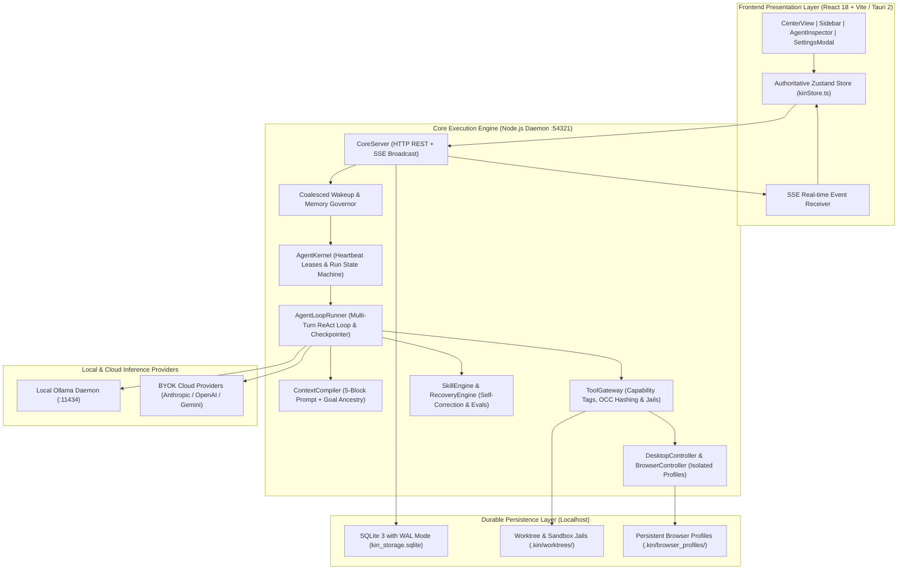

# KIN — Technical Requirements Document (TRD)
## Version 12.0 — System Architecture, IPC Contracts & Engineering Specification

**Document Version:** 12.0  
**Status:** Authoritative Technical Baseline  
**Target Runtimes:** Node.js v20+, TypeScript 5.8+, SQLite 3 (WAL Mode), React 18, Vite 6, Tauri 2, Ollama  
**Operating Systems:** Windows 10/11, macOS, Linux  

---

## 1. System Topology & Architecture

KIN is engineered as a local-first, modular monolith composed of three primary layers operating over ultra-low-latency local IPC:



---

## 2. Authoritative Database Schema & Storage Invariants

All system state is persisted in an authoritative local SQLite database running with `PRAGMA journal_mode = WAL`, `PRAGMA synchronous = NORMAL`, and foreign key enforcement enabled.

### 2.1 Core Schema Entities
1. **Workspaces & Projects**: Root filesystem paths, default autonomy policies (`AUTO`, `ALWAYS_ASK`, `FULL_ACCESS`).
2. **Agent Personas & Identities**: System prompts, default and active models, domain authority arrays, capability tags.
3. **Agent Runs (`agent_runs`)**:
   - `state CHECK (state IN ('created', 'queued', 'running', 'waiting_for_tool', 'waiting_for_approval', 'waiting_for_agent', 'waiting_for_model', 'recovering', 'quota_paused', 'resuming', 'paused', 'completed', 'failed', 'cancelled'))`
   - `heartbeat_at INTEGER NOT NULL`: Enforces 15-second heartbeat leases.
   - `quota_resets_at INTEGER`: Stores backoff expiry for paused runs.
   - `interrupted_turn INTEGER DEFAULT 0`: Checkpoint turn marker for zero-loss recovery.
4. **Goals & Distributed Task Leases (`tasks`)**:
   - `claimed_by_run_id TEXT REFERENCES agent_runs(id) ON DELETE SET NULL`
   - `lease_expires_at INTEGER`: Milliseconds timestamp lease.
   - `retry_count INTEGER NOT NULL DEFAULT 0`: Reclaim failure counter.
5. **Turn Checkpoints (`checkpoints`)**:
   - `run_id`, `turn_index`, `snapshot_json` (serialized messages, tool actions, pending approvals).
6. **Managed Credentials (`managed_credentials`)**:
   - Secure provider credential vault with encrypted keys, scoped capability grants, and daily token spend caps.
7. **Agent Evaluations (`agent_evaluations`)**:
   - Automated benchmark test suites, quantitative scores (0-100), rubric criteria metrics, and evaluator rationale.
8. **Optimistic Concurrency File Revisions (`file_revisions`)**:
   - SHA-256 baseline hashing on file reads to detect external modifications before writes (`StaleWriteConflictError`).
9. **Action Records & Event Journal (`action_records`, `event_journal`)**:
   - Immutable audit trail of every tool call, duration, parameters, risk tier, and operator approval.

---

## 3. Core Execution Lifecycle & Resilience Mechanisms

### 3.1 Turn-by-Turn Checkpointing & Crash Resumption
- **Turn Checkpointing**: After every tool invocation or assistant turn, `AgentLoopRunner` serializes the active conversation trajectory and pending actions to SQLite `checkpoints`.
- **Startup Recovery Sweep**: On daemon initialization, `runSupervisorSelfHealing()` queries for abandoned runs (`heartbeat_at < now - 45s`).
- **Zero-Loss Resumption**: The UI displays a Docked Crash Recovery Banner with 1-click **Resume All**, **Inspect State**, and **Discard** actions. Resumption rehydrates context directly from the SQLite snapshot and continues from turn `N + 1`.

### 3.2 HTTP 429 Quota Guard
- Intercepts `429 Too Many Requests` and `RESOURCE_EXHAUSTED` errors from external providers.
- Transitions run to `quota_paused`, calculates the reset window via `Retry-After` header or exponential backoff, and docks a Quota Pause Banner with live countdown.
- Provides immediate **Resume Now** manual override and **Switch to Local Ollama** 1-click fallback.

### 3.3 Atomic Distributed Task Leases
- Implements `claimTaskWithLease(taskId, agentId, runId, leaseDurationMs)` using atomic SQL:
  ```sql
  UPDATE tasks
  SET status = 'running', assigned_agent_id = ?, claimed_by_run_id = ?, lease_expires_at = ?, updated_at = ?
  WHERE id = ? AND (status IN ('ready', 'backlog') OR (status = 'running' AND lease_expires_at < ?))
  ```
- Expired leases are automatically reclaimed by the supervisor watchdog (`reclaimExpiredTaskLeases`).

### 3.4 Goal Ancestry Propagation
- `ContextCompiler` compiles a 5-block prompt. In Block 1, it injects the authoritative **Goal Ancestry & Objective Anchor**:
  ```
  ### STRATEGIC GOAL ANCESTRY & OBJECTIVE ANCHOR:
  - Workspace: <workspaceName>
  - Project: <projectName> (<repoPath>)
  - Overarching Goal: "<goalTitle>"
  - Goal Acceptance Criteria: <criteria 1>, <criteria 2>
  - Current Active Task: "<taskTitle>"
  - Task Objective: "<taskDescription>"
  ```
- Ensures subagents never suffer goal drift during deep multi-turn delegations.

### 3.5 Event-Driven Coalesced Wakeup Queue
- `WakeupQueue` enforces a 1000ms coalescing window per `agentId:channelId` pair to merge duplicate wakeup calls.
- Interrogates `ComputerSupervisor` and `os.freemem()` before dispatching; if free RAM drops below 500MB, dispatch is queued to prevent OS out-of-memory thrashing.

---

## 4. Antigravity Slash Command Specification

| Command | Syntax | Behavior | Task Creation |
|---|---|---|---|
| `/plan` | `/plan <objective> [\| step1 \| step2]` | Decomposes objective into milestone DAG tasks in SQLite and begins Phase 1 | Yes (DAG tasks) |
| `/boost` | `/boost <target>` | Verifies git working tree, WAL stats, and engages maximum autonomy execution | Yes (Audit task) |
| `/teamwork-preview` | `/teamwork-preview` | Discovers all project specialists, active models, channel assignments, and project pulse | No |
| `/goal` | `/goal <title> [\| desc] [\| criteria]` | Creates persistent goal milestone and initializes first ready task | Yes (Initial task) |
| `/btw` | `/btw <query>` | Ephemeral side-query; runs single-turn inference with `💡 [Side Query / BTW]` badge | No |
| `/grill-me` | `/grill-me <topic>` | Interactive architectural interview; renders selectable questionnaire card saving to ADR decisions | Yes (ADR decision) |
| `/schedule` | `/schedule <time>[s\|m\|h] <prompt>` | Non-blocking one-shot timer; wakes agent automatically without polling loop | Yes (Schedule item) |
| `/routine` | `/routine <interval\|cron> <prompt>` | Proactive recurring cron or interval routine with automated awakening | Yes (Routine item) |

---

## 5. Security & Privacy Guarantees

1. **Strict Path Jail Confinement**: All file read/write operations validate that the resolved target path is strictly within the project jail root. Directory traversal (`../`) and prefix collisions are rejected with 403 Forbidden.
2. **Financial Safety Shield**: Sensitive operations (`stripe`, `billing`, checkout buttons) trigger the Human Authorization Protocol and halt execution until explicit operator signoff.
3. **Opt-in Computer Automation**: Desktop mouse/keyboard control is guarded by a single-flight mutex (`DesktopLock`) preventing conflicting inputs.
4. **Bring Your Own Key (BYOK) Encryption**: Provider API keys are encrypted at rest with scoped grants and daily spending caps.
5. **Zero Cloud Telemetry**: 100% of messages, tasks, goals, decisions, and turn checkpoints reside in local SQLite storage.
